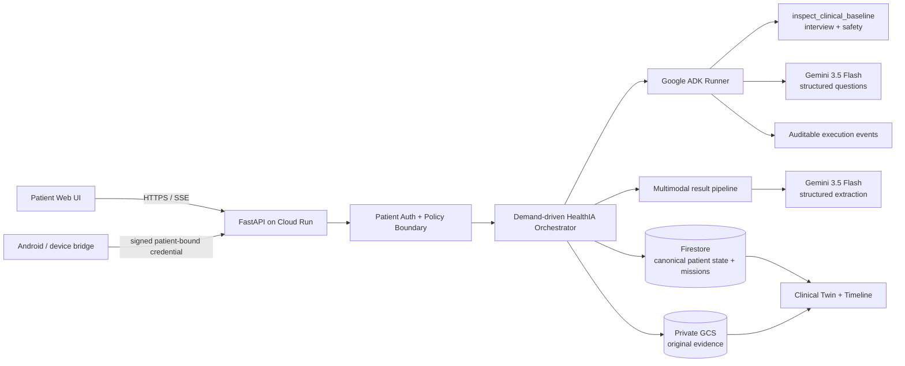

# HealthIA ONE

> **Your health never starts over.**

HealthIA ONE is a patient-owned continuity agent that turns scattered health evidence into durable, patient-scoped missions. It does more than answer: it can decide what information is missing, preserve original clinical evidence, use Gemini to extract what is actually readable, update longitudinal state, retrieve the saved evidence later, and close a Taskmaster mission only when the durable outcome exists.

**Hackathon track:** The Taskmaster  
**Google AI:** Gemini 3.5 Flash on Vertex AI  
**Agent framework:** Google ADK  
**Cloud:** Cloud Run + Firestore + private Cloud Storage + Vertex AI + Secret Manager  
**JUDGE Ω:** **99/100 evidence-backed; only final video publication/Devpost URL remains**

The public/demo flows use synthetic patients and synthetic clinical files only.

## Why this is not just a chatbot

### Adaptive clinical interview

A free-text complaint triggers a demand-driven Google ADK runtime. The latency-sensitive clinical planner performs one real aggregate function-tool call, `inspect_clinical_baseline`, which executes the mandatory deterministic **interview + safety** checks and audits both separately. Gemini 3.5 Flash then returns exactly five case-specific questions under a structured JSON contract.

Later blocks receive the actual prior prompts/answers, avoid asking known facts again, and allow Gemini to decide whether another block or a patient-facing orientation is appropriate. The model does not get to invent its own evidence of tool execution: `selected_specialists` is reconstructed from the tools that actually ran.

### Closed-loop Taskmaster result mission

A result workflow is durable work, not a generated paragraph:

1. patient uploads a PDF/image;
2. original bytes are persisted first in private GCS;
3. Gemini 3.5 Flash performs multimodal extraction under a bounded JSON schema;
4. structured result state is committed to Firestore;
5. the clinical twin receives provenance to the result + original document;
6. a later request retrieves the exact persisted study;
7. HealthIA returns the saved explanation/original link;
8. the mission becomes `COMPLETED` only when the persisted evidence exists;
9. correlated `result_id`, `document_id` and closure markers remain attached;
10. the outcome survives logout/login and a real Cloud Run revision while another patient remains isolated.

The retrieval/closure step does not call Gemini again merely to paraphrase evidence already persisted.

### Event-driven rather than a permanent swarm

HealthIA does not run a permanent polling agent swarm. Work starts from a patient message, result upload, device event or explicit continuity request. Proactive background execution is disabled in the proof deployment.

## Proof, not claims

The permanent judge evidence index is [`docs/EVIDENCE.md`](docs/EVIDENCE.md). Sanitized machine-readable copies are under [`hackathon/evidence/`](hackathon/evidence/).

### Continuous final judge demo — PASS

- GitHub Actions run: **`31265639488`**
- candidate SHA: **`3f99e511f6518e8dc9b45ebfd0cbdc37aaa9768e`**
- artifact: **`HealthIA-ONE-final-judge-demo`** (`9024139098`)
- artifact digest: `sha256:71ee6e2ce665a9b98e44ca11aae7c7334849b73ac7e756b157afa47b3a249f33`
- video SHA-256: `cfd91b0d08cf6659e1fb924c2e85071cd3b79bd414578b7112908c46f91adb19`
- continuous WebM duration: **290.16 s**
- Cloud Run revision shown: **`healthia-one-demo-00016-mct`**
- synthetic data only: **true**

The one-take browser recording visibly covers the problem, value proposition, live Gemini + ADK interaction, multimodal result, original evidence, clinical-twin linkage, completed Taskmaster mission, logout/relogin continuity, the `.run.app` URL and live readiness proving Gemini 3.5 Flash + ADK + Firestore + GCS. The run passed with zero browser console/page errors and the recording gate was immediately disabled after capture.

Sanitized evidence: [`hackathon/evidence/final_judge_demo_proof.json`](hackathon/evidence/final_judge_demo_proof.json).

**Boundary:** the video content is now proven. The final stable judge-facing/public video URL still has to be published and placed into the Devpost package before `100/100` / `SUBMISSION_LOCKED` is claimed.

### Exact-candidate Cloud + browser proof — PASS

- GitHub Actions run: **`31262429792`**
- exact candidate SHA: **`a28955c3641c37a9e5a06f5f0ccf943ccb197bbd`**
- artifact: **`healthia-exact-candidate-cloud-proof`** (`9023242539`)
- artifact digest: `sha256:4760e89b6985fa81b532e4ed2fb094abcb8859f57c92259886c152d4632a55b6`
- Cloud Run proof revision: **`healthia-one-demo-00012-jvl`**
- Cloud URL: `https://healthia-one-demo-tkuxk5r6rq-uc.a.run.app`

The same run passed the strict API proof and a full **unmocked Chromium** journey. Evidence includes Gemini 3.5 Flash through Vertex AI/ADC, real Google ADK tool execution, two memory-preserving five-question blocks, patient-scoped Firestore, private GCS original evidence, multimodal PDF extraction, clinical-twin provenance, completed Taskmaster mission, two-patient isolation, logout/relogin restoration, original evidence round trip, and **zero browser console/page errors**.

### Cross-revision continuity proof — PASS

- GitHub Actions run: **`31262903731`**
- artifact: **`healthia-cloud-revision-continuity-proof`** (`9023298988`)
- artifact digest: `sha256:4a30950483141ce55fa6f1256fa83998f0337a5e873576fa6f8598b111592263`
- before: `healthia-one-demo-00013-2bz`
- after: `healthia-one-demo-00014-ns8`
- same container image across the revision: **true**

After a genuinely new Cloud Run revision, patient A could reauthenticate and retained the longitudinal marker, multimodal result, document, completed mission and twin linkage. The GCS object generation and original SHA-256 were unchanged. Patient B remained unable to see or download patient A evidence.

### Earlier one-request Vertex Taskmaster proof — PASS

Run **`31228561751`** independently demonstrated that one Gemini 3.5 multimodal request can persist result/original/twin and that HealthIA can later close the mission from durable evidence after the model-request ceiling is exhausted.

### Explicitly excluded

Run **`31203021748` is not a passing proof**. Its live Google AI path ended in HTTP 429 because credits/quota were depleted. It is intentionally excluded from the judge evidence set.

## Architecture



Key boundaries:

- **Vertex AI uses ADC/service identity**; no Gemini API key is injected into Cloud Run.
- **Firestore** is canonical durable patient state.
- **GCS** preserves original evidence independently of model output.
- **Secret Manager** stores application signing material, not a hidden Gemini key.
- **Cloud Build and Cloud Run use separate identities**.
- **Cloud Run** proof deployment uses min `0`, max `1`.
- **Clinical ADK** uses one aggregate tool call for mandatory interview/safety, with the executed roles audited separately.
- **Dependency boundary:** the application installs Google ADK core and declares Firestore/GCS clients explicitly; it does not pull the broad unused `google-adk[gcp]` extras bundle.
- **PDF multimodal input** uses low visual media resolution with native PDF text to reduce latency; clinical images retain high visual resolution.
- Multimodal failure is fail-closed: original evidence remains stored and the result stays pending rather than fabricating an interpretation.

See [`docs/ARCHITECTURE.md`](docs/ARCHITECTURE.md).

## Clinical truth boundary

HealthIA ONE is a patient continuity system, not a physician, emergency service or autonomous prescription engine. It may organize patient-entered evidence, surface safety signals, explain what a result says and does not prove, generate questions, and maintain patient-controlled missions.

It must not confirm a diagnosis from insufficient evidence, prescribe/start/stop/change medication, declare a dangerous presentation safe, invent unread findings, or replace professional/emergency evaluation.

Do **not** upload real patient identifiers or real clinical records to the hackathon demo.

## Run locally — zero Google AI spend by default

### Windows

```powershell
python -m venv .venv
Set-ExecutionPolicy -Scope Process Bypass
.\.venv\Scripts\python.exe -m pip install --upgrade pip
.\.venv\Scripts\python.exe -m pip install -e ".[test]"
.\deployment\run-local-secure.ps1
```

### macOS / Linux

```bash
python -m venv .venv
source .venv/bin/activate
python -m pip install --upgrade pip
python -m pip install -e ".[test]"
HEALTHIA_LLM_BACKEND=mock \
HEALTHIA_COST_MODE=local \
HEALTHIA_AI_REQUEST_LIMIT=0 \
uvicorn app.main:app --port 8000
```

The default local path performs **zero Google AI calls**.

## Vertex AI configuration

```text
HEALTHIA_LLM_BACKEND=gemini_api
HEALTHIA_MODEL=gemini-3.5-flash
GOOGLE_GENAI_USE_VERTEXAI=true
GOOGLE_CLOUD_PROJECT=<project-id>
GOOGLE_CLOUD_LOCATION=global
```

`healthia_one/google_ai_transport.py` routes the Cloud candidate through Vertex AI/ADC while retaining a guarded Developer API fallback for local development.

## Deploy a bounded Cloud proof environment

```powershell
.\deployment\deploy-cloud-demo.ps1 `
  -ProjectId YOUR_PROJECT_ID `
  -RequestLimit 20
```

For non-interactive provisioning add `-Confirmed`.

The proof path expects the required Google Cloud APIs to be **pre-enabled**. It does not silently enable project services; `deployment/check_cloud_permissions.py` and the deployment scripts fail closed when the project/identity is not ready.

The deployment uses Cloud Run min `0`/max `1`, Gemini 3.5 Flash through Vertex AI, Firestore Native state, private GCS evidence, dedicated build/runtime service accounts, Secret Manager for signing secrets, an explicit model request ceiling, proactive execution disabled, and a strict post-deploy verifier.

Billable proof/recording workflows are explicit opt-in. A legacy automatic deployment path discovered during hardening was retired; ordinary CI must not create Cloud revisions or spend model quota. The one-take demo trigger is also returned to `enabled=false` immediately after a controlled recording.

Cleanup without deleting persistent proof data:

```powershell
.\deployment\remove-cloud-demo.ps1 `
  -ProjectId YOUR_PROJECT_ID `
  -ServiceName healthia-one-demo
```

## Verification

```bash
pytest
python scripts/full_system_check.py
python -m compileall -q app healthia_one healthia_agent tests scripts deployment
python scripts/smoke_test.py
python scripts/judge_omega.py
node --check web/app.js
node --check web/patient-record.js
node --check web/family-documents.js
node --check web/continuity.js
node --check web/privacy-controls.js
node --check web/profile-devices.js
node --check web/icons.js
```

The CI gate additionally runs Chromium, semantic JavaScript validation, PowerShell parsing, release ZIP verification, and pytest again from the extracted release.

## Core patient capabilities

- adaptive clinical conversations;
- longitudinal timeline and clinical twin;
- multimodal result ingestion with original evidence retention;
- labs, CT/MRI/X-ray/ultrasound/ECG/pathology/report classification;
- treatment and medication check-ins without autonomous prescribing;
- appointments and consultation briefs;
- pathological family genogram with provenance;
- weight, activity and vitals;
- Health Connect / Android bridge contract;
- patient-controlled consent, snooze, audit and JSON export;
- signed patient/device/connection identity.

## Repository map

```text
app/                 FastAPI gateway and static hosting
healthia_one/        patient state, safety, AI transport, evidence and missions
healthia_agent/      Google ADK application
deployment/          local/Cloud deploy and strict proof tooling
demo/                synthetic fixtures
docs/                architecture, evidence and submission documentation
hackathon/evidence/  sanitized permanent proof metadata
scripts/             deterministic/live evidence workflows
web/                 patient chat interface
tests/               regression, isolation and runtime contracts
```

## Submission status

**Proven:** Gemini 3.5 Flash on Vertex AI; real Google ADK tool execution; Cloud Run; Firestore; private GCS; multimodal extraction; closed-loop Taskmaster mission; patient isolation; unmocked browser journey; original-evidence provenance; logout/login continuity; cross-revision durability; reproducible release; and a continuous judge-demo artifact covering problem → value → live app → Cloud proof.

**Sole remaining gate before 100/100:** publish that proven video at the stable judge-facing URL used by Devpost, insert the exact URL into the submission package, run final CI/JUDGE on that exact head, then merge/lock PR #29.

See [`docs/EVIDENCE.md`](docs/EVIDENCE.md), [`docs/DEMO_SCRIPT.md`](docs/DEMO_SCRIPT.md), and [`docs/DEVPOST_SUBMISSION.md`](docs/DEVPOST_SUBMISSION.md).
