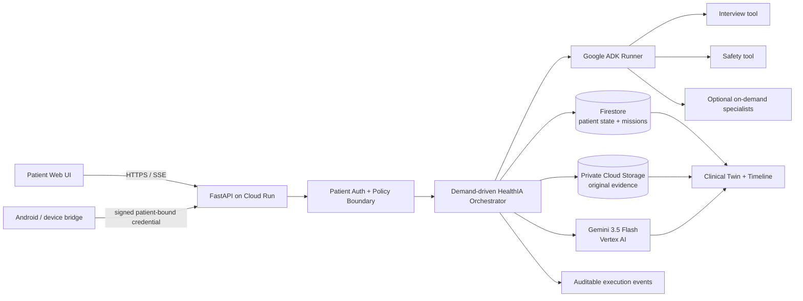

# HealthIA ONE

> **Your health never starts over.**

HealthIA ONE is a patient-owned continuity agent that turns scattered health evidence into durable, patient-scoped missions. Instead of behaving like a chatbot that only answers questions, it can accept a result, preserve the original evidence, interpret it with Gemini, update a longitudinal clinical twin, retrieve that result later, explain it in context, and close the work with correlated evidence.

**Hackathon track:** The Taskmaster  
**Google AI:** Gemini 3.5 Flash on Vertex AI  
**Agent framework:** Google ADK  
**Cloud architecture:** Cloud Run + Firestore + private Cloud Storage + Vertex AI + Secret Manager

The public/demo paths use synthetic patients and synthetic clinical files only.

---

## The problem

Patients carry fragments of their health across PDFs, images, laboratory portals, prescriptions, devices, family history and memory. Ordinary chat loses continuity: a result may be discussed once and then disappear from the working context.

HealthIA ONE treats each interaction as part of a durable patient-controlled state. The agent can decide what information is missing, activate only the specialists needed for the current goal, persist evidence, and complete multi-step health-continuity missions without running a permanent swarm in the background.

## What makes it agentic

### 1. Adaptive clinical interview

A free-text complaint does **not** launch a prefabricated questionnaire. Gemini + Google ADK build five case-specific questions from the current complaint, longitudinal context and previous answers. Later blocks receive the exact previous question prompts and answers, avoid verbatim repetition, and Gemini decides when enough information exists to stop asking and provide a patient-facing orientation.

Mandatory ADK tools are `interview` and `safety`; no more than two optional specialists are selected for a turn. Tool execution is audited without exposing private chain-of-thought.

### 2. Closed-loop Taskmaster result mission

A result mission is a real workflow, not a text-generation demo:

1. patient uploads a PDF/image;
2. the **original bytes are persisted first**;
3. Gemini 3.5 Flash performs multimodal extraction under a structured JSON schema;
4. the structured result is committed to patient state;
5. the clinical twin is updated with provenance;
6. a later chat request retrieves that exact persisted study;
7. HealthIA returns the saved patient explanation and original evidence link;
8. the mission becomes `COMPLETED` only when the persisted result exists;
9. `result_id`, `document_id` and closure markers remain attached as evidence;
10. the closed outcome survives logout/login and remains invisible to another patient.

The retrieval phase does not need to call Gemini again merely to paraphrase already persisted evidence.

### 3. Demand-driven agents

HealthIA does not run a permanent polling swarm. Server/browser state propagation is event-driven, and specialist agents are activated when a user goal requires them. Proactive background execution is disabled by default and in the Cloud demo.

### 4. Patient identity and evidence boundaries

- salted `scrypt` password hashes;
- signed `HttpOnly` patient sessions;
- patient-scoped Memory/JSON/Firestore state;
- patient-scoped SSE events;
- device credentials bound to patient + device + connection identity;
- original clinical files stored before model interpretation;
- private evidence paths and no fabricated fallback when a file cannot be read.

---

## Evidence already captured

### Live Vertex Taskmaster proof — PASSED

GitHub Actions run: **31228561751**  
Candidate SHA: **d01c06fc40d074c15da4f43513aff32dd93060c9**  
Artifact: **healthia-vertex-taskmaster-one-request-proof** (`9012957895`)  
Artifact ZIP SHA-256: `2dd927ad058b519bbc815da68c668078305ee8f95aef4c76c5d3d53fca584542`

The run authenticated to project `healthia-6088a` with Google Cloud ADC, used **Gemini 3.5 Flash on Vertex AI**, and enforced a **one-model-request ceiling**.

Passed evidence includes:

- authenticated patient creation;
- the single allowed Gemini request interpreting the synthetic PDF and persisting result + original + clinical twin;
- original PDF byte-for-byte round trip;
- result retrieval closing the Taskmaster mission after the AI ceiling was already exhausted;
- authenticated patient-B isolation from patient-A result/document/mission;
- the completed outcome surviving logout/login.

This proof intentionally separates *AI work* from *durable workflow completion*: once Gemini has extracted the evidence, HealthIA can finish the mission from persisted state without spending another model request.

### Earlier live Gemini + ADK interview proof — PASSED

GitHub Actions run **31203021748** demonstrated authenticated dynamic question generation, multi-block memory, Gemini-selected closure, auditable Google ADK tool execution, multimodal evidence, two-patient isolation and restart-safe patient continuity.

### Deterministic verification

The repository CI executes the complete pytest suite, a 14-flow system verifier, Chromium end-to-end smoke, compile checks, JavaScript syntax validation, PowerShell parsing, Judge Ω, release ZIP verification and pytest again from the extracted release.

A green deterministic suite is necessary but is **not** presented as proof of a real Cloud deployment; Cloud proof is a separate gate.

---

## Architecture



### Why these boundaries

- **Vertex AI uses ADC/service identity**, not a Gemini API key inside Cloud Run.
- **Firestore** is the canonical durable patient state boundary.
- **Cloud Storage** retains original uploaded evidence separately from model output.
- **Secret Manager** is used for durable application signing secrets, not for a Gemini key.
- **Google ADK** provides auditable, on-demand agent/tool execution.
- **Cloud Run** scales to zero and the demo caps maximum instances at one.
- **Cloud Build and Cloud Run use separate service accounts** so build-time permissions are not inherited by the clinical runtime.

See [`docs/ARCHITECTURE.md`](docs/ARCHITECTURE.md) for implementation detail.

---

## Clinical truth boundary

HealthIA ONE is a patient continuity system, not a physician, emergency service or autonomous prescription engine.

It may organize patient-entered evidence, surface deterministic safety signals, explain what a result says and does not prove, generate questions for a professional, and maintain patient-controlled missions.

It must not confirm a diagnosis from insufficient evidence, prescribe/start/stop/change medication, declare a dangerous presentation safe, invent unread clinical findings, or replace professional/emergency evaluation.

Do **not** upload real patient identifiers or real clinical records to a public hackathon demo.

---

## Run locally — zero spend by default

### Windows

```powershell
python -m venv .venv
Set-ExecutionPolicy -Scope Process Bypass
.\.venv\Scripts\python.exe -m pip install --upgrade pip
.\.venv\Scripts\python.exe -m pip install -e ".[test]"
.\deployment\run-local-secure.ps1
```

### macOS / Linux

```bash
python -m venv .venv
source .venv/bin/activate
python -m pip install --upgrade pip
python -m pip install -e ".[test]"
HEALTHIA_LLM_BACKEND=mock \
HEALTHIA_COST_MODE=local \
HEALTHIA_AI_REQUEST_LIMIT=0 \
uvicorn app.main:app --port 8000
```

The default local path performs **zero Google AI calls**.

A guarded Developer API path remains available for local development, but the final hackathon Cloud architecture uses Vertex AI + ADC.

---

## Vertex AI configuration

Cloud/runtime variables:

```text
HEALTHIA_LLM_BACKEND=gemini_api
HEALTHIA_MODEL=gemini-3.5-flash
GOOGLE_GENAI_USE_VERTEXAI=true
GOOGLE_CLOUD_PROJECT=<project-id>
GOOGLE_CLOUD_LOCATION=global
```

`healthia_one/google_ai_transport.py` keeps the Developer API fallback for local use while routing the Cloud candidate through `genai.Client(vertexai=True, project=..., location=...)`.

Multimodal result extraction uses Vertex controlled generation with `application/json` and a JSON schema. HealthIA fails closed to `pending_multimodal` if extraction cannot be trusted.

---

## Deploy the judge-facing Cloud demo

The deploy helper provisions a conservative Cloud proof environment:

- Cloud Run: min `0`, max `1`;
- Gemini 3.5 Flash through Vertex AI;
- Firestore Native patient state;
- private GCS evidence bucket with public-access prevention;
- dedicated Cloud Build and Cloud Run runtime service accounts;
- Secret Manager only for session/device signing secrets;
- AI request ceiling and proactive execution disabled;
- strict post-deploy verifier.

```powershell
.\deployment\deploy-cloud-demo.ps1 `
  -ProjectId YOUR_PROJECT_ID `
  -RequestLimit 20
```

For CI/non-interactive provisioning add `-Confirmed`.

The script enables `aiplatform.googleapis.com`, grants the runtime identity `roles/aiplatform.user`, grants the dedicated build identity `roles/run.builder`, and **does not inject `GEMINI_API_KEY`**.

After deployment, `deployment/verify_cloud_demo.py` verifies the real service rather than accepting a successful deploy command as proof. It checks authenticated A/B isolation, live Gemini/ADK behavior, Firestore persistence, original GCS evidence and clinical-twin continuity.

Cleanup without destroying persistent proof data:

```powershell
.\deployment\remove-cloud-demo.ps1 `
  -ProjectId YOUR_PROJECT_ID `
  -ServiceName healthia-one-demo
```

Optional destructive cleanup flags exist for the bucket, secrets, runtime/build service accounts or project and require explicit confirmation.

### Cloud deployment gate status

The repository includes `deployment/check_cloud_permissions.py`, a **non-mutating** `testIamPermissions` gate. Real Cloud Run/Firestore/GCS proof is not claimed until that gate and `verify_cloud_demo.py` pass.

---

## Verification

```bash
pytest
python scripts/full_system_check.py
python -m compileall -q app healthia_one healthia_agent tests scripts deployment
python scripts/smoke_test.py
python scripts/judge_omega.py
node --check web/app.js
node --check web/patient-record.js
node --check web/family-documents.js
node --check web/continuity.js
node --check web/privacy-controls.js
node --check web/profile-devices.js
node --check web/icons.js
node --check web/clinical-council.js
node --check web/runtime-integrations.js
node --check web/provider-integrations.js
node --check web/cost-control.js
```

Live proofs are separate GitHub Actions workflows so deterministic CI never silently spends model quota.

---

## Core patient capabilities

- adaptive clinical conversations;
- longitudinal timeline and clinical twin;
- multimodal result ingestion with original evidence retention;
- labs, CT/MRI/X-ray/ultrasound/ECG/pathology/report classification;
- treatment and medication check-ins without autonomous prescribing;
- appointments and consultation briefs;
- pathological family genogram with provenance;
- weight, activity and vitals;
- Health Connect / Android bridge contract;
- patient-controlled consent, snooze, audit and JSON export;
- device pairing with signed patient/device/connection identity.

---

## API highlights

- `/api/auth/register`, `/api/auth/login`, `/api/auth/logout`
- `/api/chat`
- `/api/bootstrap`
- `/api/results/upload`
- `/api/documents` and `/api/documents/{id}/download`
- `/api/twin`
- `/api/timeline`
- `/api/vitals`, `/api/weight`, `/api/activity`
- `/api/treatment`, `/api/treatment/checkins`
- `/api/family`
- `/api/appointments`
- `/api/audit`
- `/api/export`
- `/api/events/stream`

---

## Repository structure

```text
app/                 FastAPI gateway and static hosting
healthia_one/        patient state, safety, AI transport, evidence and missions
healthia_agent/      Google ADK application
deployment/          local/Cloud deploy, permission and strict proof tooling
demo/                synthetic fixtures
docs/                architecture, safety, cost and demo documentation
scripts/             deterministic and live evidence workflows
web/                 patient chat interface
tests/               regression, isolation and runtime contracts
```

## Source disclosure

Product ideas and patient-flow lessons were informed by earlier private HealthIA work supplied by the project owner. The old codebase/history was not imported into this repository. This is a clean hackathon implementation, and no claim is made that pre-existing work was created during the event.

## Status boundary

**Proven:** live Gemini 3.5 Flash on Vertex AI, one-request closed-loop Taskmaster mission, original evidence round-trip, clinical twin update, patient isolation, durable relogin outcome, and deterministic CI gates on evidenced candidate SHAs.

**Still a hard gate:** real Cloud Run + Firestore + GCS deployment/restart proof and the final approximately four-minute unedited judge demo. The project must not be described as 100/100 or submission-complete until those artifacts exist.
