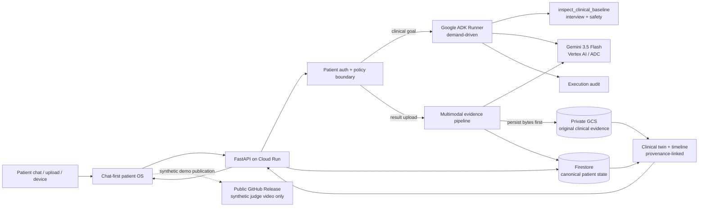
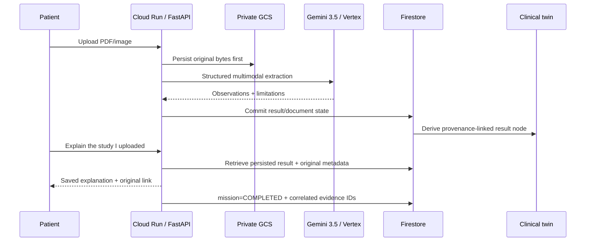

# HealthIA ONE architecture

## Judge view: one event-driven Taskmaster system



The hackathon Cloud transport is **Gemini 3.5 Flash through Vertex AI using Google Cloud ADC/service identity**. A Gemini API key is not injected into Cloud Run.

The public submission video is deliberately **not** stored in the patient clinical-evidence bucket. It is a GitHub Release asset containing synthetic demo data only; the clinical GCS bucket remains private.

## Execution model

HealthIA does not run a permanent agent swarm. Work begins because a patient sends a message, uploads evidence, a bound device syncs, or the patient explicitly requests continuity work.

```text
patient/event goal
  → deterministic auth/safety boundary
  → load authenticated patient state
  → invoke the minimum demand-driven agent/tool path
  → persist outcome + evidence
  → emit updated patient state
```

### Clinical ADK path

```text
patient complaint + authorized longitudinal context
  → Google ADK Runner
  → exactly one aggregate tool call: inspect_clinical_baseline
       ↳ deterministic interview check
       ↳ deterministic safety check
  → Gemini 3.5 Flash (thinking=minimal)
  → structured JSON: exactly five adaptive questions
  → runtime derives executed specialist evidence from real tool execution
```

`interview` and `safety` are audited separately even though they execute inside one aggregate call. The model is not trusted to assert that a tool ran. Prior questions/answers are supplied to later blocks so the agent can avoid repeated facts and decide whether to continue interviewing or produce a patient-facing orientation.

## Dependency boundary

The runtime installs **Google ADK core** (`google-adk`) rather than the broad optional `google-adk[gcp]` extras bundle. HealthIA explicitly declares the Cloud clients it actually uses — `google-cloud-firestore`, `google-cloud-storage` and `google-genai`.

`tests/test_dependency_boundaries.py` and FORJA runtime contracts prevent accidental dependency re-expansion.

## Closed-loop Taskmaster result mission



A mission closes only when the requested persisted result exists. It retains `result_id`, `document_id` and closure evidence. Retrieval can complete without another Gemini call merely to restate evidence already stored.

## Multimodal truth boundary

`healthia_one/result_ai.py` supports PDF, PNG, JPEG and WebP and classifies common result types including laboratory reports, CT/TAC, MRI/RM, X-ray, ultrasound, ECG/EKG, pathology and clinical reports.

Production-proof behavior:

- original bytes are persisted **before** interpretation;
- PDF uses low visual media resolution while retaining native PDF text;
- clinical images retain high visual resolution;
- output uses controlled JSON generation with a compact schema;
- `thinking_level=minimal`;
- proof deployment output ceiling is 1400 tokens;
- multimodal work has a dedicated 45-second ceiling;
- failed/unreadable evidence is never fabricated: original evidence remains stored and state stays `pending_multimodal`.

## Canonical state and clinical twin

`PatientState` is the typed canonical contract shared by API, persistence, agents and UI. It contains profile, vitals, weight, activity, results, documents, treatment/check-ins, family history, appointments, missions, messages, audit events and idempotency data.

The clinical twin is **derived** from canonical state. It is not a second writable source of truth. Result nodes retain provenance to the persisted result and original document.

## Identity and security boundaries

- salted `scrypt` password hashes;
- HMAC-signed `HttpOnly` application sessions;
- patient-scoped Memory/JSON/Firestore state;
- patient-scoped document paths;
- cross-patient document lookup denied;
- device credentials bind patient + connection + device + expiry;
- stable signing secrets make device identity restart-safe;
- original clinical evidence remains private;
- public submission media contains synthetic demo data only and lives outside the clinical GCS boundary.

## Google Cloud architecture

### Cloud Run

Proof deployment uses min `0`, max `1`, proactive work disabled, an explicit per-process AI request ceiling, application patient authentication and a dedicated runtime identity.

### Vertex AI

The runtime identity uses Vertex AI through ADC. No Gemini API key is required in Cloud Run.

### Firestore

`FirestoreStore` is canonical persistent patient state. Proof tooling independently reads Firestore to compare durable state with API behavior.

### Cloud Storage

Original clinical bytes are stored in a **private** bucket under patient-scoped paths. Proof tooling validates object URI, generation, size and byte integrity.

### Secret Manager

Secret Manager stores application signing material such as session/device secrets; it is not used to hide a Gemini API key.

### Build/runtime separation

Cloud Build and Cloud Run use separate service identities so build-time privileges do not automatically become clinical-runtime privileges.

## Cost and mutation safety

Required Google Cloud APIs are expected to be pre-enabled. Provisioning fails closed if services or permissions are missing.

Billable Cloud evidence, live recording and publication mutation workflows are explicit opt-in. Ordinary CI must not deploy Cloud or consume Gemini quota. The Cloud, recording and publication triggers are returned to `enabled=false` after controlled proof runs.

A legacy automatic `workflow_run` deployment path discovered during hardening was removed.

## Five independent proof layers

### 1. Deterministic CI — PASS

- pytest;
- 14 full-system flows;
- Chromium E2E;
- compileall;
- smoke/JUDGE;
- frontend semantics/syntax;
- PowerShell parsing;
- release ZIP verification;
- pytest from extracted release.

### 2. Exact-candidate Cloud + browser — PASS

Run `31262429792`, candidate `a28955c3641c37a9e5a06f5f0ccf943ccb197bbd`, revision `healthia-one-demo-00012-jvl`.

Proves Cloud Run, Vertex Gemini 3.5, real Google ADK execution, Firestore, private GCS, two-patient isolation, multimodal PDF extraction, twin provenance, original evidence round trip and a full unmocked Chromium journey with zero console/page errors.

Evidence: `hackathon/evidence/cloud_exact_candidate_proof.json`.

### 3. Cross-revision continuity — PASS

Run `31262903731` changed Cloud Run revision from `healthia-one-demo-00013-2bz` to `healthia-one-demo-00014-ns8` with the same container image. Patient A state/result/document/mission/twin and exact GCS evidence survived; patient B remained isolated.

Evidence: `hackathon/evidence/cloud_revision_continuity_proof.json`.

### 4. Continuous judge demo — PASS

Run `31265639488`, candidate `3f99e511f6518e8dc9b45ebfd0cbdc37aaa9768e`.

- artifact `9024139098`;
- video SHA-256 `cfd91b0d08cf6659e1fb924c2e85071cd3b79bd414578b7112908c46f91adb19`;
- duration `290.16 s`;
- live revision `healthia-one-demo-00016-mct`;
- problem/value/app/Cloud runtime visible;
- live Gemini 3.5 + ADK + Firestore + GCS;
- completed Taskmaster mission;
- relogin continuity;
- zero console/page errors.

Evidence: `hackathon/evidence/final_judge_demo_proof.json`.

### 5. Stable public video publication — PASS

**Public video:**  
`https://github.com/arisnachy/healthia-one/releases/download/healthia-one-hackathon-judge-demo-2026/HealthIA-ONE-final-judge-demo.webm`

Publication run `31267268584` recovered and revalidated the source artifact, published the GitHub Release asset, downloaded it anonymously and matched the original SHA. Independent probe run `31267268597` independently downloaded the full public asset without credentials and matched the same SHA.

Evidence: `hackathon/evidence/public_judge_video_proof.json`.

## Current truth boundary

HealthIA ONE is a synthetic hackathon release candidate, not a regulated medical device, clinical-effectiveness study or autonomous prescribing system. Green tests prove software behavior within tested boundaries; they do not establish medical efficacy, regulatory compliance or universal security certification.

All internal JUDGE hard gates are now proven. The **100/100 score is an evidence-backed rubric assessment, not a guarantee that external hackathon judges will award a win**. Final operational lock requires the exact final branch head to pass CI/JUDGE/public-video probe and PR #29 to merge without changing that verified head.