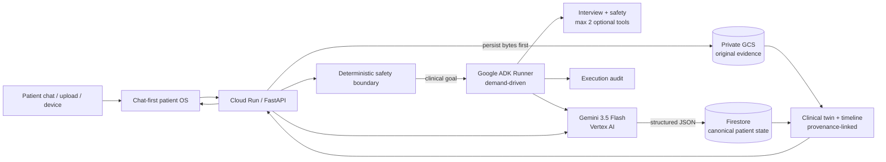
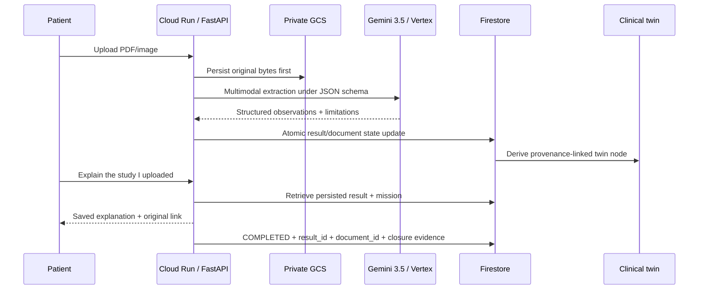

# HealthIA ONE architecture

## Judge view: one event-driven Taskmaster workflow



The final hackathon transport is **Gemini 3.5 Flash through Vertex AI using Google Cloud ADC/service identity**. `GEMINI_API_KEY` remains only as a reversible local Developer API fallback; it is not injected into the Cloud Run candidate.

## Execution model

There is no permanent agent swarm and no repeated browser device-pairing polling loop. Work begins because a patient sends a message, uploads evidence, a bound device syncs, or the patient explicitly asks for a continuity review.

```text
patient/event goal
  → deterministic safety boundary
  → load authenticated patient state
  → select minimum useful ADK tools
  → execute only on demand
  → persist outcome/evidence
  → emit state event
```

For clinical interviewing, `interview` and `safety` are mandatory. At most two optional specialist tools can be added. The real executed tool trajectory is persisted as an audit event; model chain-of-thought is never exposed.

## Closed-loop Taskmaster result mission

The result workflow is deliberately stronger than “upload and summarize”:



A mission closes only when the requested persisted result exists. It carries correlated `result_id`, `document_id` and explicit closure markers. Retrieval can finish after the one-request AI budget is exhausted, proving that durable workflow completion is not just another model call.

## Multimodal truth boundary

`healthia_one/result_ai.py` supports PDF, PNG, JPEG and WebP with result hints for laboratory reports, CT/TAC, MRI/RM, X-ray, ultrasound, ECG/EKG, pathology and other clinical reports.

On Vertex, extraction uses controlled JSON generation:

- `response_mime_type=application/json`;
- explicit JSON schema;
- bounded output tokens;
- `thinking_level=minimal`;
- no invented unread text/measurements/findings.

If model output cannot be trusted, the original evidence remains stored and the result stays `pending_multimodal`. HealthIA does not fabricate a replacement interpretation.

## Canonical patient state and clinical twin

`PatientState` is the typed canonical contract shared by API, storage, agents and UI. It includes profile, vitals, weight, activity, results, documents, medication plans/check-ins, family history, appointments, missions, messages, audit events and idempotency keys.

The twin in `healthia_one/twin.py` is **derived** from canonical state; it is never a second source of truth. Result/twin nodes retain provenance to the persisted result and original document so an older study can be found and reopened later.

## Identity boundaries

Patient access uses salted `scrypt` password hashes and HMAC-signed `HttpOnly` sessions. Memory, JSON and Firestore state are patient-scoped.

Device pairing is event-driven:

```text
browser creates short-lived single-use code
  → Android claims it once
  → server issues signed credential
  → credential binds patient + connection + device + expiry
  → device sync must present matching credential/device id
```

With a stable `HEALTHIA_DEVICE_TOKEN_SECRET`, signed device credentials remain verifiable across process revisions/restarts.

## Google Cloud production-proof path

### Cloud Run

The demo is bounded to:

- `min=0`;
- `max=1`;
- proactive background work disabled;
- explicit per-process AI request ceiling;
- authenticated application-level patient boundary.

### Vertex AI

Cloud Run's runtime service account receives `roles/aiplatform.user` and creates the SDK client with:

```python
genai.Client(vertexai=True, project=project, location=location)
```

No Gemini API key is required in Cloud Run.

### Firestore

`FirestoreStore` persists the canonical patient state under authenticated patient identity. The strict verifier reads the resulting Firestore document directly to confirm that API behavior and persisted state agree.

### Cloud Storage

`evidence_store.py` writes original clinical bytes to a private bucket with patient-scoped object paths. The strict verifier confirms the expected `gs://` provenance and the real object generation/size.

### Secret Manager

Secret Manager is restricted to application signing material such as session/device secrets. It is **not** used to smuggle a Gemini API key into the Vertex deployment.

## Cloud gates

`deployment/check_cloud_permissions.py` calls Google Cloud `testIamPermissions` before provisioning. It performs **zero mutations** and fails closed if the GitHub deploy identity cannot safely create/update the required demo resources.

`deployment/deploy-cloud-demo.ps1` then provisions the bounded stack and calls `deployment/verify_cloud_demo.py`.

A deployment is not accepted as proven merely because `gcloud run deploy` returns success. The strict proof must demonstrate:

```text
Cloud Run URL + ready revision
+ authenticated patient A/B isolation
+ Vertex Gemini 3.5 live behavior
+ real Google ADK tool trajectory
+ Firestore canonical state
+ private GCS original evidence
+ multimodal result extraction
+ clinical twin provenance
+ byte-for-byte original download
+ durable state across reconnect/revision test
```

## Live evidence already captured

The one-request Vertex Taskmaster proof on candidate `d01c06fc40d074c15da4f43513aff32dd93060c9` passed on GitHub Actions run `31228561751` using project `healthia-6088a` and `gemini-3.5-flash`.

It proved:

- authenticated patient creation;
- one Gemini request persisted result + original + twin;
- original evidence round-trip;
- closed-loop mission completion after the AI ceiling was reached;
- patient B isolation;
- durable completed outcome after patient A logout/login.

This is distinct from the Cloud Run/Firestore/GCS deployment gate, which remains unclaimed until the strict Cloud verifier passes.

## Verification layers

The exact candidate must pass:

- Python test suite;
- 14 full API/state workflows;
- Chromium E2E;
- Python compilation including Cloud proof tooling;
- smoke test;
- Judge Ω evidence review;
- semantic JavaScript syntax checks;
- PowerShell parsing;
- deterministic release ZIP verification;
- pytest again from the extracted release.

Live Vertex proofs are separated from deterministic CI so ordinary regression testing does not silently spend model quota.

## Current truth boundary

HealthIA ONE is a synthetic hackathon release candidate, not a regulated medical device or autonomous clinical decision-maker. A green test suite does not establish clinical effectiveness, legal compliance or security certification. Cloud is only considered proven after an authenticated Cloud Run/Firestore/GCS verifier artifact exists on an exact candidate SHA.
