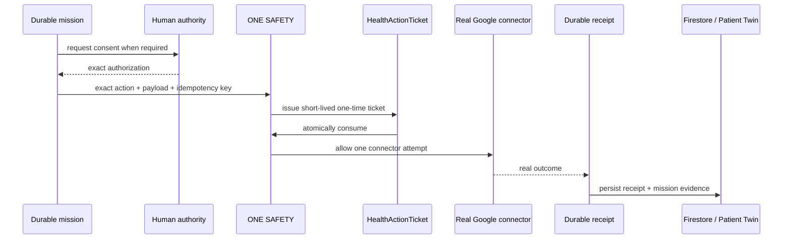

# HealthIA ONE architecture

## One living, event-driven health system

```mermaid
flowchart LR
    S[Patient chat / clinical evidence / Health Connect / events]
    API[FastAPI on Cloud Run]
    AUTH[Patient identity + policy]
    ARMOR[Deterministic ingress + Google Model Armor]
    ADK[Google ADK / Gemini 3.5 Flash]
    MISSION[Durable patient mission]
    HUMAN[Human consent / authority boundary]
    SAFE[ONE SAFETY kernel]
    TICKET[One-time HealthActionTicket]
    CONN[Real Google connector]
    RECEIPT[Durable connector receipt]
    FS[(Firestore canonical patient state)]
    GCS[(Private GCS original evidence)]
    TWIN[Patient Twin + longitudinal timeline]
    TRACE[OpenTelemetry → Google Cloud Trace]

    S --> API --> AUTH
    AUTH --> ARMOR
    ARMOR -->|reasoning when useful| ADK
    ARMOR -->|deterministic path when bounded| MISSION
    ADK --> MISSION
    MISSION --> FS
    S -->|clinical file| GCS
    GCS -->|provenance| FS
    FS --> TWIN
    MISSION -->|sensitive/external action| HUMAN
    HUMAN --> SAFE --> TICKET --> CONN --> RECEIPT --> FS
    SAFE -. sanitized operational span .-> TRACE
    CONN -. sanitized operational span .-> TRACE
    RECEIPT --> TWIN
```



HealthIA's central architectural invariant is:

```text
authorization != execution ticket != connector execution != completion evidence
```

A model can reason about what to do. It cannot grant itself permission, mint durable proof that an external action happened, or mark real-world work complete merely by generating convincing text.

---

## Execution model

HealthIA is demand/event-driven rather than a permanently active model swarm. Work can begin because the patient sends a message, new clinical evidence is uploaded, an authorized device signal arrives, a durable follow-up becomes due, or a previously authorized external event resumes a mission.

The runtime chooses the smallest appropriate path:

```text
Sense → Understand → Decide → Authorize → Act → Prove → update the Patient Twin
```

Three decision mechanisms coexist intentionally:

1. **Gemini / Google ADK reasoning** for interpretation and planning.
2. **Deterministic policy** for exact bounded decisions.
3. **Human authority** when the patient decision must remain human.

More model calls are not treated as more autonomy.

---

## AI ingress: two independent defenses

Every new untrusted chat message crosses a deterministic local prompt-injection policy before model execution. In Cloud, the same new untrusted text is also screened by **Google Model Armor** with the regional `healthia-one-safety` template in `us-central1`.

HealthIA does not send conversation history, the system prompt or the patient's clinical record to Model Armor merely to screen a new user message.

Cloud mode fails closed if Model Armor is enabled but unavailable or incomplete, unless the deployment owner deliberately activates the documented recovery switch.

A real Google Cloud adversarial gate requires the configured PI/jailbreak filter to return `MATCH_FOUND` for a controlled synthetic instruction that attempts to override system rules, expose hidden instructions and bypass authorization.

---

## ONE SAFETY: final execution authority

`HealthIASafetyKernel` sits immediately before connector execution.

For an authorized action it issues a short-lived `HealthActionTicket` bound to:

- patient ID;
- mission ID;
- exact Google action;
- exact material payload / intent key;
- authorization ID when required;
- idempotency key;
- expiry;
- canonical OpenTelemetry Trace ID when tracing is active.

The ticket is consumed once. A modified payload, different mission/action, expired ticket or second use fails closed.

The ticket proves only that **one exact execution attempt was allowed to cross the connector boundary**. It does not prove the outside world changed. Only the real connector outcome generates the durable receipt that can satisfy completion evidence.



---

## Observability without clinical leakage

OpenTelemetry is automatically enabled for HealthIA Cloud deployments. Google Cloud Trace export uses the runtime service identity with `roles/cloudtrace.agent`.

The guarded connector span records only sanitized operational facts such as action/service family, whether the action mutates external state, `HealthActionTicket` ID, durable receipt ID, outcome and idempotent-replay state.

Prompts, clinical observations and PHI are not exported as trace attributes.

For judge evidence, the active 32-hex Trace ID is persisted on the `HealthActionTicket`. The proof pipeline then queries **that exact Trace ID back from Google Cloud Trace** and requires a `google.action.guarded_execute` span before evidence is promoted.

The protected operational surface `/security` renders:

```text
Cloud Trace ID → HealthActionTicket → durable receipt → connector outcome
```

---

## Canonical state and Patient Twin

Firestore is canonical durable patient state in Cloud. The Patient Twin is derived from that canonical state; it is not a second mutable database.

State includes demographics, vitals, device signals, clinical results, documents, treatment/check-ins, family history, appointments, missions, messages, receipts and idempotency evidence.

This is why logout/login continuity is not "LLM memory." The model can disappear and the patient story still exists.

---

## Clinical evidence truth boundary

For a synthetic PDF/image proof:

1. original bytes are persisted to private GCS **before** interpretation;
2. Gemini 3.5 Flash on Vertex AI performs bounded multimodal extraction;
3. structured observations and limitations are persisted to Firestore;
4. the Patient Twin derives a provenance-linked node;
5. unreadable/failed interpretation stays pending or fails closed rather than fabricating a finding.

Original evidence and AI-derived interpretation remain distinguishable.

---

## Real Google action architecture

HealthIA's Google Constellation separates authorization, connector execution and evidence.

Real or preserved action paths include Google Places / Maps Platform, Gmail send, Gmail `users.watch`, authenticated Pub/Sub continuation, Gmail history/exact-thread correlation, Calendar FreeBusy, Calendar event create+reread and Google Tasks create+reread.

The unattended blood-pressure continuity proof demonstrates event-driven work: a deterministic clock detects an overdue follow-up, Eventarc wakes a private Cloud Run worker, Gmail sends under standing consent, authenticated Pub/Sub recovers a reply, Gmail history correlates the thread, and a canonical VitalRecord closes the same mission only after durable evidence exists.

---

## Google ADK specialist fleet

HealthIA has a demand-driven KIRA Health ADK fleet with specialist roles including Historia, Sentinel, Lumen, Vita, Navigator, Hereditas, Archivum, MedSafe, Advocate and Bastion.

The fleet is not an execution-authority shortcut. Specialist reasoning remains above ONE SAFETY; external mutation authority remains deterministic and separately auditable.

---

## Google Cloud components

| Capability | Google / HealthIA component |
|---|---|
| Agent reasoning | Gemini 3.5 Flash on Vertex AI |
| Agent orchestration | Google Agent Development Kit + Google GenAI SDK |
| Runtime | Cloud Run |
| Canonical state | Firestore |
| Original clinical evidence | Private Google Cloud Storage |
| Secrets | Secret Manager |
| Prompt-injection defense | Google Model Armor + local deterministic policy |
| Distributed traces | OpenTelemetry + Google Cloud Trace |
| Resource discovery | Google Places / Maps Platform |
| External continuity | Gmail + Pub/Sub + Calendar + Google Tasks |
| Device pathway | Android / Health Connect + Firebase/FCM contracts |
| Build/runtime separation | distinct Google Cloud service identities |

Cloud runtime uses ADC/service identity rather than embedding a Gemini API key.

---

## Identity and security boundaries

- salted `scrypt` password hashes;
- HMAC-signed `HttpOnly` sessions;
- patient-scoped Firestore state and clinical-document paths;
- cross-patient evidence isolation;
- device credentials bound to patient + connection + device + expiry;
- stable signing secrets from Secret Manager;
- private original clinical evidence;
- synthetic-only hackathon media;
- Model Armor + deterministic prompt-ingress policy;
- exact-intent one-time execution tickets;
- idempotent connector receipts;
- no autonomous diagnosis, prescribing or medication changes.

---

## Current competition proof

### Repository verification — PASS

The current proof/reliability line repeatedly passes pytest diagnostics, full-system verification, KIRA DialogBench, real Chromium clinical E2E, LAB Ω core and secondary windows, compile+smoke, JUDGE Ω, semantic frontend checks, secure launcher parsing, verified release archive and tests inside the extracted release.

### Exact product candidate live demo — PASS

Exact product SHA:

`a851947c9e1476d2fed05f74b2b40383c408387f`

Final live workflow:

`32051146792`

The exact candidate passed Cloud Run deployment, private Judge Mode, continuous real-browser recording, Google Places/resource proof, multimodal evidence, logout/login continuity, Charon master generation and CUTLOCK.

Validated base master:

- duration `235.000 s`;
- SHA-256 `809d35ff7b2a3242eb61f52443c64f48a0ca45fc2e078ad1165ae76f724b1565`;
- voice `en-US-Chirp3-HD-Charon`, male, Google Cloud TTS, no fallback.

### Real Google Model Armor adversarial proof — PASS

Workflow:

`32051146784`

The regional `healthia-one-safety` template returned `MATCH_FOUND` for its PI/jailbreak filter on a controlled synthetic attack. Temporary provisioning privilege was removed after proof.

### Enhanced ONE SAFETY proof

The evidence harness is intentionally separate from the product candidate. Current `main` provides recorder/proof logic; the exact a851 product candidate is checked out separately and is the only runtime source deployed.

Promotion requires all of the following in one gate:

- exact candidate deployment;
- mission creation before execution;
- location authorization without execution;
- real Google Places discovery after authorization;
- Trace ID persisted on the one-time ticket;
- durable receipt correlation;
- exact Trace ID read back from Google Cloud Trace;
- hostile chat blocked before model/ticket/mutation;
- 3:55 ONE SAFETY B-roll master;
- **byte-identical Charon audio stream** versus the validated base master;
- artifact + Release publication.

### Feature freeze

`docs/HACKATHON_FEATURE_FREEZE.md` freezes new product scope until judging. Remaining accepted work is evidence, reliability, security, verified bug fixes and judge-facing clarity.

---

## Why `/living` is not a separate architecture

The Living System route is an isolated synthetic evaluator circuit inside HealthIA's proof strategy. It demonstrates deterministic replay, durable state and a visible `WAITING_HUMAN` boundary without model calls.

It is not the primary product architecture and it is not a second HealthIA.

---

## Truth boundary

HealthIA ONE is a hackathon prototype and patient-continuity system. It is not a regulated medical device, clinical-effectiveness study or autonomous prescribing system. Green software/security proofs establish behavior inside the tested boundaries; they do not establish medical efficacy, regulatory compliance or universal security certification.
