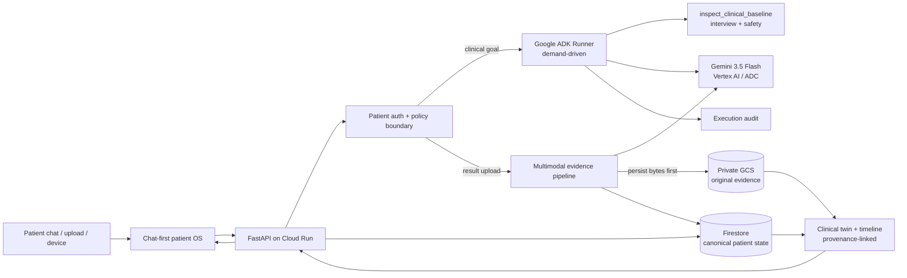
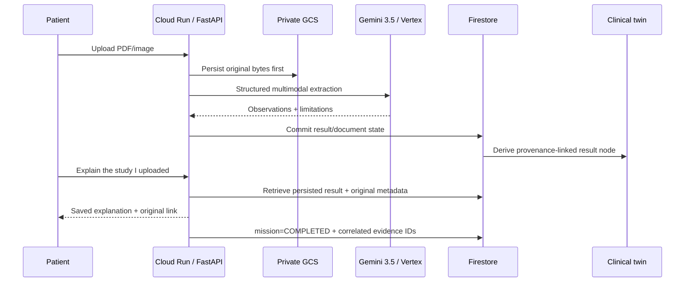

# HealthIA ONE architecture

## Judge view: one event-driven Taskmaster system



The hackathon Cloud transport is **Gemini 3.5 Flash through Vertex AI using Google Cloud ADC/service identity**. A Gemini API key is not injected into Cloud Run.

## Execution model

HealthIA does not run a permanent agent swarm. Work begins because a patient sends a message, uploads evidence, a bound device syncs, or the patient explicitly requests continuity work.

```text
patient/event goal
  → deterministic auth/safety boundary
  → load authenticated patient state
  → invoke the minimum demand-driven agent/tool path
  → persist outcome + evidence
  → emit updated patient state
```

### Clinical ADK path

The interactive clinical path is intentionally bounded for latency and auditability:

```text
patient complaint + authorized longitudinal context
  → Google ADK Runner
  → exactly one aggregate function-tool call: inspect_clinical_baseline
       ↳ deterministic interview check
       ↳ deterministic safety check
  → Gemini 3.5 Flash (thinking=minimal)
  → structured JSON: exactly five adaptive questions
  → runtime derives executed specialist evidence from the real tool trace
```

`interview` and `safety` are audited separately even though they execute inside one aggregate tool call. The model is not trusted to assert that a tool ran; `selected_specialists` is reconstructed from actual execution.

Prior questions/answers are fed into later blocks so the agent can avoid repeated facts and choose whether to continue the interview or produce a patient-facing orientation.

## Dependency boundary

The runtime deliberately installs **Google ADK core** (`google-adk`) rather than the broad optional `google-adk[gcp]` extras bundle. HealthIA declares only the Cloud clients it actually uses — `google-cloud-firestore` and `google-cloud-storage` — alongside `google-genai`.

This keeps the application dependency graph aligned with the real architecture instead of pulling unrelated BigQuery/Bigtable/Spanner/Speech-style integrations into the runtime. `tests/test_dependency_boundaries.py` and FORJA runtime contracts prevent accidental re-expansion.

## Closed-loop Taskmaster result mission



A mission closes only when the requested persisted result exists. It retains `result_id`, `document_id` and closure evidence. Retrieval can complete without another Gemini call merely to restate evidence already stored.

## Multimodal truth boundary

`healthia_one/result_ai.py` supports PDF, PNG, JPEG and WebP with result hints for laboratory reports, CT/TAC, MRI/RM, X-ray, ultrasound, ECG/EKG, pathology and clinical reports.

Production-proof behavior:

- original bytes are persisted **before** interpretation;
- PDF input uses Gemini 3 `resolution=low`, retaining native PDF text while reducing visual-media latency/token cost;
- clinical images keep `resolution=high` to protect small visual details;
- output uses controlled JSON generation with a compact bounded schema;
- `thinking_level=minimal`;
- configured multimodal output ceiling: 1400 tokens in the proof deployment;
- multimodal work gets a dedicated 45-second ceiling, separate from the interactive chat timeout;
- unreadable/failed evidence is not invented: the original remains available and state stays `pending_multimodal`.

## Canonical state and clinical twin

`PatientState` is the typed canonical contract shared by API, persistence, agents and UI. It contains profile, vitals, weight, activity, results, documents, treatment/check-ins, family history, appointments, missions, messages, audit events and idempotency data.

The clinical twin is **derived** from canonical state. It is not a second writable source of truth. Result nodes retain provenance to the persisted result and original document.

## Identity boundaries

- salted `scrypt` password hashes;
- HMAC-signed `HttpOnly` application sessions;
- patient-scoped Memory/JSON/Firestore state;
- patient-scoped document paths;
- cross-patient document lookup denied;
- device credential binds patient + connection + device + expiry;
- stable device-signing secret makes device identity restart-safe.

## Google Cloud architecture

### Cloud Run

Proof deployment:

- `min=0`;
- `max=1`;
- proactive background work disabled;
- explicit per-process AI request ceiling;
- application-level patient authentication;
- dedicated runtime identity.

### Vertex AI

The runtime service account uses `roles/aiplatform.user` and the Google GenAI client is created for Vertex AI/ADC. No Gemini API key is required in Cloud Run.

### Firestore

`FirestoreStore` is the canonical persistent patient-state backend. Proof tooling independently reads the Firestore document to compare durable state with API behavior.

### Cloud Storage

Original clinical bytes are stored in a private bucket with patient-scoped object paths. Proof tooling checks the object URI, generation, size and byte integrity.

### Secret Manager

Secret Manager stores application signing material such as session/device secrets. It is not used to smuggle a Gemini API key into the deployment.

### Build/runtime separation

Cloud Build and Cloud Run use separate service identities. Build-time privileges do not automatically become clinical-runtime privileges.

## Cost and deployment safety

The required Google Cloud APIs are expected to be pre-enabled. Provisioning fails closed if services/permissions are missing; the proof path does not silently enable project APIs.

Billable Cloud evidence and the live judge recording are explicit opt-in. Ordinary CI must not deploy Cloud or consume Gemini quota.

During hardening, JUDGE identified a legacy `workflow_run` path capable of triggering an unintended deployment after another successful workflow. That path was retired. The final one-take recording gate was also returned to `enabled=false` immediately after the passing capture.

## Four independent proof layers

### 1. Deterministic CI

Runs without silently spending Gemini quota:

- pytest;
- 14 full-system flows;
- Chromium E2E;
- compileall;
- smoke/JUDGE;
- frontend semantics/syntax;
- PowerShell parsing;
- release ZIP verification;
- pytest again from extracted release.

### 2. Exact-candidate Cloud + browser proof — PASS

GitHub Actions run `31262429792`, candidate `a28955c3641c37a9e5a06f5f0ccf943ccb197bbd`.

Proven revision: `healthia-one-demo-00012-jvl`.

The strict API verifier demonstrated Cloud Run, Vertex Gemini 3.5, real Google ADK tool execution, Firestore, private GCS, two-patient isolation, multimodal PDF extraction, twin provenance and original evidence round trip. The same workflow then executed a full unmocked Chromium journey with zero console/page errors.

Permanent sanitized evidence: `hackathon/evidence/cloud_exact_candidate_proof.json`.

### 3. Cross-revision continuity proof — PASS

GitHub Actions run `31262903731`.

The verifier prepared persistent synthetic patient A/B evidence, then forced a genuinely new Cloud Run revision **without changing the container image**:

- before: `healthia-one-demo-00013-2bz`
- after: `healthia-one-demo-00014-ns8`
- same image: true

After the revision, patient A state/result/document/mission/twin remained intact, the GCS generation and original SHA-256 were unchanged, and patient B remained isolated.

Permanent sanitized evidence: `hackathon/evidence/cloud_revision_continuity_proof.json`.

### 4. Continuous judge-demo proof — PASS

GitHub Actions run `31265639488`, candidate `3f99e511f6518e8dc9b45ebfd0cbdc37aaa9768e`.

The workflow required the same candidate to pass deterministic verification first, then reused the existing private Cloud Run service without redeploying it and recorded one continuous Playwright journey.

- artifact: `HealthIA-ONE-final-judge-demo` / `9024139098`
- artifact digest: `sha256:71ee6e2ce665a9b98e44ca11aae7c7334849b73ac7e756b157afa47b3a249f33`
- video SHA-256: `cfd91b0d08cf6659e1fb924c2e85071cd3b79bd414578b7112908c46f91adb19`
- duration: `290.16 s`
- live revision shown: `healthia-one-demo-00016-mct`
- problem/value/app/Cloud runtime visible
- Gemini 3.5 + ADK + Firestore + GCS live
- completed Taskmaster result mission
- relogin continuity
- zero console/page errors

Permanent sanitized evidence: `hackathon/evidence/final_judge_demo_proof.json`.

## Current truth boundary

HealthIA ONE is a synthetic hackathon release candidate, not a regulated medical device, clinical-effectiveness study or autonomous prescribing system. Green tests prove software behavior within the tested boundaries; they do not establish medical efficacy, regulatory compliance or universal security certification.

Functional, architecture, Gemini/ADK, Cloud, browser, cross-revision and continuous-video content gates are proven. The sole remaining submission blocker is **publication of that already-proven video at the stable judge-facing URL used by Devpost**, followed by final exact-head CI/JUDGE and merge/lock.

See `docs/EVIDENCE.md` for exact runs, artifacts and digests.
