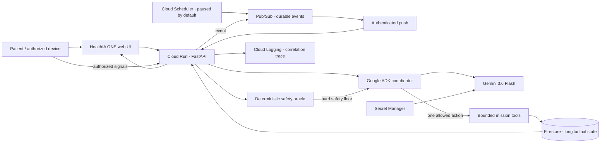

# HealthIA ONE architecture

## Judge-facing system view

HealthIA ONE is a patient-owned continuity agent. The visible chat is one input surface; the autonomous runtime also accepts authorized health events and scheduled triggers, decides whether work is necessary, invokes a bounded tool, persists evidence and keeps a mission open until its closure condition is satisfied.



The public trace exposes operational facts only:

```text
trigger → decision → tool → persistence → closure
```

It does **not** expose private chain-of-thought.

## What runs where

| Layer | Runtime | Responsibility |
|---|---|---|
| Web | Browser | Patient chat, consent, measurements, missions and public execution trace |
| API | Cloud Run / local Uvicorn | Typed API, event ingestion, SSE and bounded state mutation |
| Durable dispatch | Pub/Sub | Decouples event production from mission execution and provides retryable delivery |
| Periodic trigger | Cloud Scheduler | Publishes a `scheduled_tick`; created but paused by default to conserve credits |
| Agent runtime | Google ADK | Chooses one allowed mission action from compact authorized context |
| Model | Gemini 3.6 Flash | Performs the bounded ADK decision or generates adaptive clinical questions |
| Safety | Deterministic Python | Establishes the minimum safe action and can never be downgraded by the model |
| State | Firestore / JSON / memory | Longitudinal patient state, mission runs, artifacts and audit events |
| Secrets | Secret Manager | Gemini API key in cloud demo; never committed to the repository |
| Evidence | Cloud Logging + judge endpoints | Correlation ID, runtime, model, tool result, artifacts and closure state |

## The autonomous mission contract

An `AgenticEvent` is deliberately small and typed. Current triggers are:

- `vital_recorded`;
- `device_sync`;
- `scheduled_tick`;
- `manual_demo` for deterministic verification only.

For every actionable event:

1. HealthIA loads the latest authorized `PatientState`.
2. The deterministic safety oracle calculates the non-negotiable safety floor.
3. If no useful work exists, the event ends without a Gemini call.
4. If work exists and ADK is enabled, the cost guard atomically reserves the complete two-call worst-case budget.
5. Google ADK receives compact context and may call `commit_mission_action` once.
6. The proposed action is validated against the safety oracle.
7. A bounded deterministic tool mutates state and creates evidence.
8. Firestore persists the state, trace and artifacts together through the store contract.
9. The execution receives a correlation ID and emits structured logs.
10. The mission remains open or reaches a closure condition visible in the UI.

Allowed mission actions are intentionally narrow:

```text
open_repeat_measurement
close_repeat_measurement
escalate_professional_review
prepare_consultation_packet
no_action
```

The model cannot prescribe, change medication, confirm a diagnosis or mark an unsafe event safe.

## Closed-loop examples

### Event-driven follow-up

```text
165/102 entered
  → Pub/Sub event
  → deterministic priority floor
  → Google ADK chooses bounded follow-up
  → mission WAITING_PATIENT
  → 138/88 entered later
  → second Pub/Sub event
  → Google ADK evaluates the active mission
  → summary artifact generated
  → mission COMPLETED
```

The closure includes the source measurement IDs and artifact ID.

### Background consultation preparation

```text
Cloud Scheduler manual proof run
  → Pub/Sub scheduled_tick
  → upcoming appointment detected
  → Google ADK selects prepare_consultation_packet
  → authorized history/documents/questions organized
  → artifact persisted
  → mission COMPLETED
```

This is the strongest Taskmaster path because no patient prompt is required after the scheduled trigger.

## Cost architecture

Zero-spend is the default. The cloud proof uses a deliberately conservative guard:

- Cloud Run minimum instances `0` and maximum instances `1`;
- request-based CPU billing;
- proactive process loop disabled in cloud;
- Cloud Scheduler created **paused** and executed manually for proof;
- non-actionable events use zero model calls;
- each ADK mission reserves two model-call slots before starting (`max_llm_calls=2`);
- the proof script requires six available slots for exactly three bounded ADK missions;
- resources are removed immediately after evidence capture.

The process guard is **not** a Cloud Billing budget. A new Cloud Run instance resets it, so billing budgets/alerts and resource cleanup remain mandatory external controls.

## Patient state

`PatientState` is the shared typed contract across API, storage, agents and UI. It contains:

- profile and care plan;
- consent and quiet-hour policy;
- vitals, weight and activity;
- results and document metadata;
- family history;
- medication plans and check-ins;
- appointments and goals;
- health missions and chat messages;
- `mission_runs` with correlation IDs and public operational events;
- `mission_artifacts` with closure evidence;
- audit events and emitted-rule idempotency keys.

All mutable records use stable IDs, timestamps and source metadata where applicable.

## Safety before intelligence

```text
message / measurement / device event
        ↓
deterministic urgent-language or vital assessment
        ├── unsafe → minimum escalation cannot be downgraded
        └── bounded → ADK may choose within the allowed action envelope
```

Clinical safety does not depend on Gemini availability. If ADK, credentials, the model, Pub/Sub or the cost guard fails, the deterministic path remains available and the trace records the fallback rather than pretending the AI succeeded.

## Adaptive clinical intake

The patient interview and autonomous event runtime are related but separate:

- chat intent is interpreted semantically;
- a guarded Gemini call can generate exactly five case-specific questions from the complaint, previous answers and compact authorized context;
- specialists are selected on demand and execute deterministic tools without separate model calls;
- a zero-token adversarial gate rejects duplicate, unsafe or non-adaptive question plans;
- urgent deterministic safety bypasses the routine interview.

## Public execution evidence

The Misiones view renders each persisted mission run as a public operational trace. It maps internal implementation details to patient-readable steps and shows:

- runtime (`Google ADK`, safe fallback or local verification);
- model only when relevant;
- event;
- bounded action;
- persistence;
- verified closure;
- evidence and artifact counts;
- correlation ID.

The raw judge API is also available:

```text
GET /api/judge/mission-runs
GET /api/judge/trace/{correlation_id}
```

## Storage modes

### Verification and local demo

- `MemoryStore` for tests;
- `JsonStore` with atomic replacement for local persistence;
- ignored local document bytes.

### Google Cloud proof

- `FirestoreStore` preserves the same typed domain contract;
- Cloud Run uses a dedicated runtime service account;
- Pub/Sub uses a separate authenticated push identity with `roles/run.invoker`;
- the runtime identity receives only the Firestore, Pub/Sub publisher, logging and specific Secret Manager access needed by the demo;
- the Cloud Run service is private by default.

## Failure and recovery principles

- deterministic safety continues without a model;
- ADK output cannot downgrade the safety oracle;
- cost budget is reserved before model execution;
- Pub/Sub provides asynchronous delivery and retry behavior;
- mission actions are idempotent where repetition is plausible;
- repeated proactive findings are suppressed with stable keys;
- unread PDFs and images remain pending instead of being fabricated;
- audit records contain public operational facts, not secrets or hidden reasoning;
- patient export removes internal storage paths;
- frontend refreshes are serialized and one SSE stream is owned by the core runtime.

## Evidence boundary

The repository and hosted CI can prove the architecture, deterministic closed loops, browser behavior and deployment scripts without spending credits. They **cannot** prove a real Google Cloud deployment or real Gemini execution until `deployment/capture-cloud-proof.ps1` succeeds against an actual project.

Similarly, a final ~4-minute unedited demonstration remains a submission artifact that must be recorded after cloud proof exists.

HealthIA ONE remains a synthetic hackathon system, not a production clinical system, medical device, clinical effectiveness claim, regulatory clearance or substitute for professional care.
