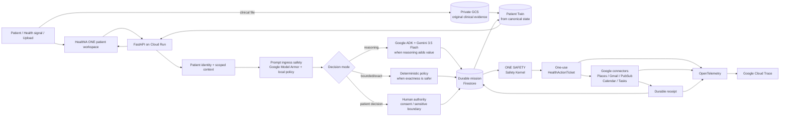

# HealthIA ONE architecture

## Judge view: one patient-owned, event-driven system

HealthIA ONE is designed around a single rule: **a model may help decide what should happen, but only policy, a bounded execution capability and real evidence may establish that an external action happened.**



This is one system. The deterministic `/living` replay, multimodal evidence flows, device events, resource navigation and unattended follow-up are observable paths through the same architecture rather than separate products.

---

## Decision architecture

HealthIA intentionally uses three decision modes.

### AI reasoning

Gemini 3.5 Flash and Google ADK are invoked when interpretation, adaptive questioning, multimodal extraction or planning adds value. The model receives only patient-scoped context appropriate to the operation.

### Deterministic policy

Exact bounded choices and safety invariants do not need probabilistic reinterpretation. Examples include ordinal candidate selection, idempotency, consent-state transitions, ticket-use rules and completion requirements.

### Human authority

HealthIA stops when the decision belongs to the patient or requires human clinical judgment. Consent is represented as durable state; it is not inferred from a model response and is not treated as proof that an external action already happened.

---

## ONE SAFETY execution boundary

External action follows this contract:

```text
proposed action
  → Safety Kernel evaluates exact scope
  → one-use HealthActionTicket is issued
  → connector attempts the bounded operation
  → durable receipt records the actual outcome
  → mission state may advance
```

### HealthActionTicket

A ticket is a narrowly scoped execution capability, not an outcome. It binds the proposed external action to the safety decision and carries the canonical Cloud Trace ID used for observability.

The runtime does not project an external operation as complete simply because:

- the model proposed it;
- the user authorized a broader goal;
- a connector was selected;
- a UI displayed a success-like message.

A real connector outcome and durable receipt are required.

### Receipt

The receipt is execution evidence. It correlates the action result back to the one-use ticket and durable mission. Failure, missing evidence or connector ambiguity does not silently become `COMPLETED`.

---

## Prompt ingress and Model Armor

The prompt boundary is layered:

1. **Google Model Armor** provides a real Google Cloud prompt-injection/jailbreak filter in `us-central1`.
2. **Local fail-closed ingress policy** preserves deterministic application behavior and provides a boundary even when a Cloud sanitization dependency is unavailable or a local/test mode is used.
3. Unsafe input is stopped before the model and before any execution ticket can be issued.

The real adversarial Cloud workflow passes only if Model Armor returns `SUCCESS`, global `MATCH_FOUND`, and `MATCH_FOUND` from the `pi_and_jailbreak` filter for the controlled hostile probe.

Proof run `32051146784` on runtime SHA `a851947c9e1476d2fed05f74b2b40383c408387f` completed successfully and removed its temporary template-editor capability afterward.

---

## State and memory

### Canonical state

Firestore is the canonical patient-scoped durable state in Cloud. It contains the typed patient record, missions, messages, evidence references, vitals, results, documents, consent state, connector outcomes, audit events and idempotency state.

### Patient Twin

The Patient Twin is **derived from canonical patient state**. It is not an independent second database that can drift away from the patient record. Timeline/result nodes preserve provenance to stored evidence and durable events.

### Chat is not memory

HealthIA does not depend on prompt history to preserve continuity. A logout/login or process replacement can reconstruct the patient story from durable state. Chat is a patient interface to the system, not the system's source of truth.

---

## Clinical evidence boundary

For supported synthetic clinical documents and images:

```text
upload
  → persist original bytes in private GCS first
  → bounded multimodal extraction
  → structured result in Firestore
  → provenance-linked Patient Twin node
```

If extraction fails or evidence is unreliable, the original remains preserved and the derived state stays pending/fails closed. HealthIA does not fabricate a clinical finding to close a workflow.

---

## Credentials and identity

HealthIA keeps human identity, runtime identity and external connector authority separate.

- patient sessions use signed, `HttpOnly` application authentication;
- password storage uses salted `scrypt` hashes;
- patient state and document paths are patient-scoped;
- device credentials bind patient, connection, device and expiry;
- Cloud Run uses a dedicated runtime service account;
- Google Cloud services use ADC/service identity rather than embedded Gemini credentials;
- Secret Manager stores application signing material and connector secrets where appropriate;
- Cloud Build and runtime identities are separated;
- temporary elevated proof permissions are removed after controlled workflows.

The public judge video contains synthetic data and is not stored in the private clinical evidence bucket.

---

## Connector architecture

Real-world operations are explicit adapters rather than model claims.

| Connector | Role in HealthIA |
|---|---|
| Google Places / Maps | bounded resource discovery after mission-scoped location consent |
| Gmail | authorized follow-up delivery and thread continuation |
| Pub/Sub | authenticated event delivery for asynchronous connector replies |
| Calendar | availability checks and authorized event creation |
| Google Tasks | authorized durable task creation |
| Health Connect bridge | patient-authorized device/event ingestion contracts |

Idempotency and receipts protect against duplicate delivery and ambiguous completion.

---

## Observability: Trace → Ticket → Receipt

HealthIA emits OpenTelemetry around guarded external execution. The one-use HealthActionTicket stores a canonical 32-hex Trace ID. Guarded execution spans carry non-PHI correlation attributes such as ticket/receipt/outcome identifiers.

The final promotion gate does not stop at “Trace exporter configured.” It reads the exact trace back from **Google Cloud Trace** and requires the same Trace ID plus the guarded execution span.

### Exact final live chain

Enhanced run `32054818666` proved:

```text
runtime candidate
  a851947c9e1476d2fed05f74b2b40383c408387f

Cloud Trace
  eec691300b7bb1c1c0564e95fb090e4f
        ↓
HealthActionTicket
  hat_021b1b6b1b4542e2
        ↓
action
  maps.search_nearby
        ↓
receipt
  receipt_95ba26286e6f4e15
        ↓
outcome
  completed
```

The connector returned 8 real Google Places candidates. Cloud Trace read-back required a span named `google.action.guarded_execute` under the exact exported Trace ID. Temporary `roles/cloudtrace.user` access used by the verifier was removed after the read-back.

---

## Adversarial no-mutation contract

The application proof sends a controlled hostile request through the real protected Cloud candidate and requires all of these conditions simultaneously:

```text
HTTP 400 at prompt_ingress
AND model_called == false
AND new HealthActionTickets == 0
AND patient-state mutation == 0
```

This is deliberately stricter than checking whether a warning appeared. The proof asserts that the unsafe instruction cannot obtain model execution or an external-action capability.

---

## Failure semantics

HealthIA fails closed at meaningful boundaries.

| Failure or uncertainty | Required behavior |
|---|---|
| prompt injection / jailbreak | stop at ingress; no model call; no ticket |
| missing consent for consent-gated action | mission may persist; connector does not execute |
| policy rejects exact action | no HealthActionTicket |
| ticket missing/expired/already used | connector execution is rejected |
| connector fails or returns no durable outcome | mission does not falsely become complete |
| duplicate asynchronous delivery | idempotent handling; no duplicate real-world effect |
| clinical extraction unreliable | original evidence preserved; derived result remains pending/fails closed |
| Cloud Trace export/read-back unavailable during promotion proof | promotion gate fails; evidence is not invented |

A language model is not an authority on whether these invariants were satisfied.

---

## Event-driven autonomy

HealthIA does not run a permanent swarm. Work begins from a meaningful event: patient message, evidence upload, authorized device signal, durable clock/follow-up condition or authenticated connector event.

This architecture reduces unnecessary model calls and keeps consent, execution and evidence visible. Deterministic work can proceed without a model when a model adds no value.

The unattended blood-pressure follow-up is an example: an opted-in synthetic patient's overdue follow-up becomes a durable mission, event infrastructure wakes the worker, authorized connector work proceeds, the reply is correlated, state is updated and the same mission closes.

---

## Living probe

`/living` is a deterministic observability probe of a human authority boundary inside HealthIA. It advances a synthetic replay, stops at `WAITING_HUMAN`, accepts an explicitly synthetic human-entered measurement receipt and resumes the same mission to completion with zero model calls.

It should not be interpreted as a separate “Living product” or as the conceptual starting point for judging HealthIA ONE.

---

## Current final evidence package

| Evidence | Current value |
|---|---|
| Runtime candidate under Cloud proof | `a851947c9e1476d2fed05f74b2b40383c408387f` |
| Proof harness that closed the enhanced package | `51c641d89a4c59bd57275ffa6ef98820394f9634` |
| Model Armor adversarial run | `32051146784` — SUCCESS |
| Enhanced ONE SAFETY run | `32054818666` — SUCCESS |
| Enhanced artifact ID | `9296123186` |
| Enhanced artifact ZIP digest | `253a474e7a8bd7fce373f3ff1f5697e0522f27810fe76d33dd4a902366cd9365` |
| Validated base video SHA-256 | `809d35ff7b2a3242eb61f52443c64f48a0ca45fc2e078ad1165ae76f724b1565` |
| Enhanced 3:55 MP4 SHA-256 | `2c82929888c613960cb44ba7cb0c111b22e8a205cf38643d3199f3a1c5e542cf` |
| Charon audio stream SHA-256 | `3a78b5e3b98c441b138b691d803e2f3859e51e2a2795db22314d6ea4b230cc16` |
| Cloud Trace ID | `eec691300b7bb1c1c0564e95fb090e4f` |
| HealthActionTicket | `hat_021b1b6b1b4542e2` |
| Receipt | `receipt_95ba26286e6f4e15` |

Final enhanced master:

https://github.com/arisnachy/healthia-one/releases/download/healthia-one-autonomous-winner-demo-2026/HealthIA-ONE-Autonomous-Taskmaster-Charon-ONE-SAFETY.mp4

Machine-readable summary: `hackathon/evidence/one_safety_final_proof.json`.

---

## Reproducibility and cost boundary

Ordinary CI does not need live Gemini or Cloud mutation. Local deterministic verification can run with the mock backend and zero AI-request budget. Controlled Cloud proofs are explicit, bounded and clean up temporary services/permissions when complete.

The exact proof workflows are:

- `.github/workflows/one-safety-cloud.yml` — Model Armor + Cloud Trace substrate and adversarial gate;
- `.github/workflows/one-safety-enhanced-master.yml` — exact candidate deployment, live Trace/Ticket/Receipt proof, exact Cloud Trace read-back and final master;
- `scripts/record_one_safety_judge_proof.py` — live mission + no-mutation recorder.

---

## Truth boundary and feature freeze

HealthIA ONE is a synthetic hackathon prototype. These proofs establish software behavior within the tested boundaries; they do not establish clinical efficacy, regulatory approval or universal security certification. HealthIA does not autonomously diagnose, prescribe, start/stop/change medication or replace professional/emergency evaluation.

The judging build is under **feature freeze**. New capabilities are not being added for score. Remaining changes are restricted to evidence integrity, reliability, reproducibility and public judge-facing synchronization.
