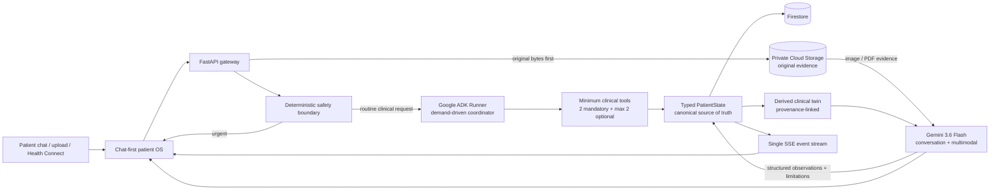
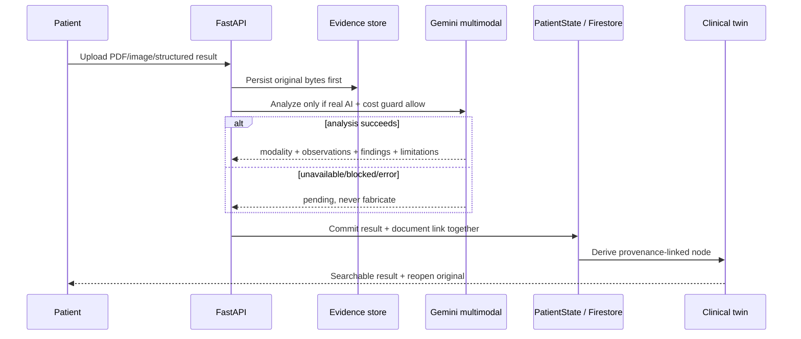

# HealthIA ONE architecture

## Judge view: one event-driven patient workflow



The runtime has no permanent server polling loop and the browser has no repeated device-pairing interval. Work starts because a patient sends a message, uploads evidence, a paired device syncs, or the patient explicitly requests a review.

## Clinical state and evidence ownership

`PatientState` is the canonical typed contract shared by the API, storage, agent runtime and UI. It contains:

- patient profile, care context and patient-control policy;
- vitals, weight, activity and Health Connect observations;
- structured results;
- family-history members;
- clinical document metadata and links to original evidence;
- medication plans and patient-reported check-ins;
- appointments and goals;
- health missions and chat messages;
- audit events and idempotency keys.

The clinical twin in `healthia_one/twin.py` is **derived** from this canonical state. It never becomes an independent source of truth. Each result node carries the persisted result ID and the linked original document ID, so the chat can return to an older TAC, ECG, laboratory report or other study and the patient can reopen the source file.

## Safety before intelligence

```text
patient event
    ↓
deterministic safety checks
    ├── urgent → stop routine flow → human-care escalation
    └── non-urgent → demand-driven Google ADK planning
```

Clinical safety does not depend on Gemini or ADK availability. A model cannot downgrade a deterministic urgent finding, prescribe medication, change a dose, or declare an isolated uploaded image diagnostic.

## Google ADK runtime: no static demo patient

The live clinical planner is `healthia_one/adk_runtime.py` and is invoked through `AdkGeminiResponder`. For each clinical request it receives only the current authorized `PatientState` and creates an ADK session. The ADK coordinator must execute:

1. interview requirements;
2. safety context;
3. at most two additional tools selected because the case needs them.

Optional tools cover longitudinal history, medication safety, available documents/results, family context, follow-up and privacy scope. The resulting tool trajectory is captured from the functions that actually executed, not from model self-report, and is persisted as a public audit event:

```text
actor: google_adk
action: execute_demand_driven_clinical_plan
resource: ADK session id
details: model + stage + executed roles + public tool outputs
```

The patient-facing block still contains exactly five adaptive questions. Existing answers are supplied to the planner so the next block can move the interview forward rather than repeat a template.

`healthia_agent/agent.py` contains no hard-coded patient snapshot. It is only the package-level ADK topology and safety contract; patient-specific evidence enters through the per-request runtime bridge.

## Result ingestion and multimodal truth boundary



Supported multimodal evidence includes PDF, PNG, JPEG and WebP with hints for laboratory reports, CT/TAC, MRI/RM, radiography, ultrasound/sonography, ECG/EKG, pathology and other clinical reports. The prompt explicitly forbids invented text, measurements or findings. If a file cannot be analyzed, the original remains stored and the result remains pending rather than receiving a synthetic interpretation.

## Device identity and Health Connect

Pairing is event-driven:

```text
browser creates one short-lived code
        ↓
Android claims code once
        ↓
server issues signed credential
        ↓
credential binds patient + connection + device + expiry
        ↓
Health Connect sync must present matching credential + device id
```

The credential is an HMAC-signed envelope; bearer values are not stored server-side. With `HEALTHIA_DEVICE_TOKEN_SECRET` from Secret Manager, the credential remains verifiable after a Cloud Run restart. Local development without a stable secret intentionally reports `process_local_secret` rather than pretending restart durability.

The browser waits once on `/api/devices/pairing/{code}/wait` and can cancel with `AbortController`; it does not call `setInterval()` every few seconds.

## Patient interfaces

The browser shell loads one visual system and semantic modules:

- `app.js`: chat, measurement forms, result upload/reopen and SSE;
- `patient-record.js`: composer, voice, patient record and contextual actions;
- `family-documents.js`: genogram and document archive;
- `continuity.js`: timeline, treatment and appointments;
- `privacy-controls.js`: consent, privacy, audit and export;
- `profile-devices.js`: complete patient profile, event-driven pairing and Health Connect surfaces;
- `icons.js`: dependency-free icon system.

Version-number UI patch layers are prohibited. JavaScript syntax, browser behavior and release packaging are verified in CI.

## Storage

### Local / CI

- `MemoryStore` for isolated tests.
- `JsonStore` with atomic replacement for local persistence.
- patient-scoped local evidence files under ignored `uploads/<patient_id>/...` paths.

### Google Cloud path

- `FirestoreStore` persists the canonical typed patient state.
- `evidence_store.py` persists original clinical bytes to a private GCS bucket and stores durable `gs://...` provenance in the document record.
- Cloud Run uses `min=0`, `max=1` for the bounded demo and receives Gemini/device secrets from Secret Manager.
- the device credential secret is created cryptographically if absent and is never printed by the deployment script.

`deployment/verify_cloud_demo.py` is a strict proof gate. A Cloud deployment cannot be called proven unless one run demonstrates all of the following:

```text
Cloud Run health
+ Firestore active store
+ private GCS original evidence
+ live Gemini request
+ Google ADK tool trajectory
+ exactly five dynamic clinical questions
+ restart-safe device credential
+ Gemini multimodal PDF extraction
+ clinical-twin provenance link
+ byte-for-byte original evidence download
```

The repository also contains a non-mutating GitHub Actions authentication probe. If no Google Cloud Project ID/credential is configured in GitHub Secrets, it records `HEALTHIA_GCP_AUTH_BLOCKED` and performs no deployment or billable Cloud action.

## Event-driven continuity

Clinical and continuity evaluators remain available, but there is no timer waking them continuously. They run only from an explicit patient/event path. Findings pass through consent, snooze, mute and quiet-hour controls before any unsolicited message can be emitted.

```text
event / explicit review
  → evaluate current state
  → already emitted?
  → patient-control policy
  → emit only if authorized
  → persist audit
```

This preserves continuity logic without turning the system into a background message generator.

## Verification gates

The hosted CI must pass on the exact candidate SHA:

- Python test suite;
- 14 full API/state workflows;
- real Chromium E2E;
- Python compilation including Cloud proof tooling;
- smoke test;
- Judge Ω evidence evaluator;
- JavaScript syntax checks;
- PowerShell parser checks;
- deterministic release ZIP build and verification;
- a second pytest run from the extracted ZIP.

Browser screenshots and the verified release ZIP are retained as GitHub Actions artifacts.

## Current truth boundary

The repository is a tested synthetic release candidate, not a production clinical system or regulated medical device. Local/CI verification does not establish clinical effectiveness, legal compliance, security certification or regulatory clearance. Google Cloud is only considered proven after an authenticated strict-cloud proof produces an actual Cloud Run URL/revision and the verifier artifact; repository code alone is not accepted as Cloud evidence.
