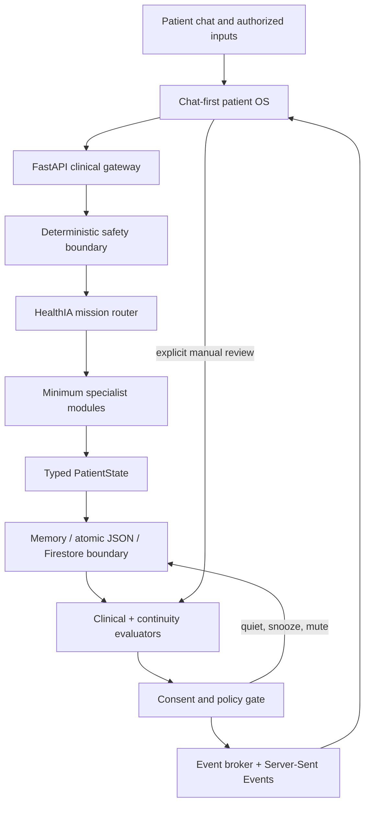

# HealthIA ONE architecture

## System view



## Patient state

`PatientState` is the shared typed contract across API, storage, agents and UI. It contains:

- profile and care plan;
- consent and quiet-hour policy;
- vitals, weight and activity;
- results;
- pathological family members;
- document metadata;
- medication plans and check-ins;
- appointments and goals;
- health missions and chat messages;
- audit events and emitted-rule idempotency keys.

All mutable records carry stable IDs, timestamps and source metadata where applicable.

## Safety before intelligence

```text
patient message or measurement
        ↓
deterministic urgent-language / vital checks
        ├── urgent → stop routine flow and escalate to human care
        └── non-urgent → semantic routing and specialist work
```

Clinical safety does not depend on Gemini availability. The model is not allowed to downgrade deterministic urgent findings.

## Agent topology

The internal Google ADK graph uses specialist modules for longitudinal context, safety, result explanation, habits, follow-up, family history, document organization, treatment safety, consultation preparation and consent control. Internal implementation names are intentionally excluded from the patient-facing web surface.

The public interface displays actions, evidence, uncertainty and next steps. It never renders private chain-of-thought.

## Proactive execution

Two evaluators remain separated:

1. **Clinical evaluator**: missing measurements, material weight change, extreme vitals, low activity, unreviewed results and family-history context.
2. **Continuity evaluator**: upcoming appointments and patient-reported medication omissions.

Every finding passes through the patient-control policy:

```text
finding
  → already emitted?
  → urgent authorized bypass?
  → explicit manual review?
  → proactive enabled?
  → snoozed?
  → muted rule?
  → quiet hours?
  → emit and audit
```

Explicit patient-requested reviews can run during quiet hours because they are not unsolicited notifications. Background execution always remains consent-bound.

## Patient interfaces

The browser shell loads one visual system and semantic interface modules:

- `app.js`: core chat, measurement forms, results and SSE;
- `patient-record.js`: composer, voice, patient record and contextual actions;
- `family-documents.js`: genogram and document archive;
- `continuity.js`: timeline, treatment and appointments;
- `privacy-controls.js`: consent, privacy, audit and export;
- `profile-devices.js`: complete patient profile and Health Connect surfaces;
- `icons.js`: dependency-free icon system.

Version-number UI patches are prohibited. Every semantic module has static contracts and Node syntax checks in CI.

## Storage

### Local demonstration

- `MemoryStore` for tests.
- `JsonStore` with atomic replacement for local persistence.
- document bytes under ignored `uploads/patient_demo` paths.

### Cloud boundary

- `FirestoreStore` preserves the domain contract.
- Dockerfile and Cloud Run manifest are present.

Production requires private Cloud Storage for files, Firestore security rules, authentication, tenant isolation, transaction/idempotency tests and durable scheduling through Cloud Tasks or Pub/Sub.

## Main API groups

```text
/chat and /events/stream
/vitals /weight /activity /results
/family
/documents
/timeline
/treatment
/appointments /consultation-brief
/consent /audit /export
```

FastAPI publishes the generated OpenAPI interface at `/docs`.

## Failure and recovery principles

- deterministic safety continues without a model;
- repeated proactive findings are suppressed with stable rule keys;
- backdated records are sorted by their event time, not upload order;
- a missing Gemini key does not break the deterministic local demo;
- unread PDFs and images remain pending instead of being fabricated;
- audit records contain public operational facts, not secrets or hidden reasoning;
- patient export removes internal storage paths;
- frontend refreshes are serialized and only one event stream is created;
- recursive identity-rewriting observers are prohibited.

## Current truth boundary

The repository is a tested synthetic release candidate, not a production clinical system or regulated medical device. Local and CI verification do not establish clinical effectiveness, security certification, legal compliance or regulatory clearance.
