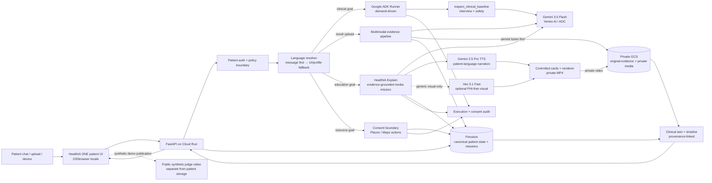
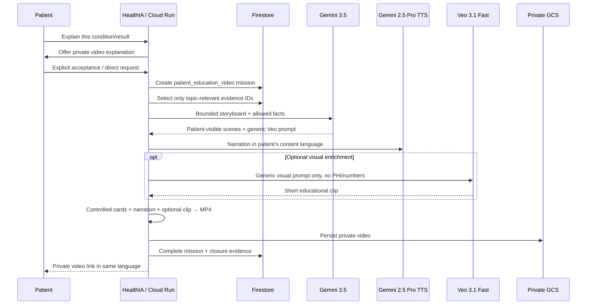
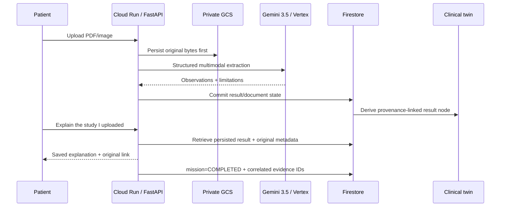

# HealthIA ONE architecture

## Judge view: one event-driven Taskmaster system



The hackathon Cloud transport uses **Gemini 3.5 Flash through Vertex AI with Google Cloud ADC/service identity**. HealthIA Explain adds **Gemini 2.5 Pro TTS** for patient narration and an optional **Veo 3.1 Fast** visual. A Gemini API key is not injected into the Cloud Run proof deployment.

The public submission video is deliberately **not** stored in the patient clinical-evidence bucket. It contains synthetic demo data only. Patient evidence and generated patient education media remain private.

## Execution model

HealthIA does not run a permanent agent swarm. Work begins because a patient sends a message, uploads evidence, a bound device syncs, or the patient explicitly requests continuity work.

```text
patient/event goal
  → deterministic auth/safety boundary
  → resolve current patient language
  → load authenticated patient state
  → invoke the minimum demand-driven model/tool path
  → pause at explicit human boundaries when required
  → persist outcome + evidence
  → resume the same durable mission
```

## Language boundary

HealthIA treats UI locale and conversation locale as separate state.

```text
browser / OS locale ────────→ patient UI language
                                  │
patient current message ─────→ content language
        │                         │
        ├─ confident language ────┘
        └─ ambiguous/short ─────→ UI/profile fallback

content language
  → Gemini patient response language
  → HealthIA Explain storyboard language
  → Gemini TTS language/voice profile
```

The shipped interface currently has production English and Spanish packs and selects them from `navigator.languages` / `navigator.language` unless the patient has a saved manual override. The conversation/video language layer supports a broader explicit locale set and falls back instead of inventing unsupported locale behavior.

Medication names, exact result values and units remain unchanged when sourced from the patient record.

## Clinical ADK path

```text
patient complaint + authorized longitudinal context
  → Google ADK Runner
  → exactly one aggregate tool call: inspect_clinical_baseline
       ↳ deterministic interview check
       ↳ deterministic safety check
  → Gemini 3.5 Flash (thinking=minimal)
  → structured JSON: exactly five adaptive questions
  → runtime derives executed specialist evidence from real tool execution
```

`interview` and `safety` are audited separately even though they execute inside one aggregate call. The model is not trusted to assert that a tool ran. Prior questions/answers are supplied to later blocks so the agent can avoid repeated facts and decide whether to continue interviewing or produce a patient-facing orientation.

## HealthIA Explain path



### Truth/safety split

- **Gemini 3.5 Flash** plans patient-friendly educational structure from an explicitly allowed evidence subset.
- **Controlled HealthIA cards** render exact patient-specific values, medications, measurements and warning labels.
- **Veo** receives only a generic visual prompt. Names, ages, dates, medications, laboratory values, measurements and identifiers are rejected from the Veo boundary.
- **Gemini TTS** may narrate authorized patient-specific information because it runs behind the same patient/mission Google grant and receipt boundary.
- The video cannot diagnose a new disease, prescribe, change a dose or tell the patient to stop medication.
- Media failure remains a retryable mission; HealthIA never fabricates a successful artifact.

Long narration is split at sentence boundaries below the Gemini TTS unary input limit, generated as compatible LINEAR16 parts and merged before rendering.

## Closed-loop Taskmaster result mission



A mission closes only when the requested persisted result exists. It retains `result_id`, `document_id` and closure evidence. Retrieval can complete without another Gemini call merely to restate evidence already stored.

## Consent + Google action boundary

For location-sensitive resource discovery, HealthIA does not silently call Places. The durable mission pauses, asks for mission-scoped consent, then resumes the **same** mission after authorization.

Real candidates are persisted and the patient can select an exact candidate deterministically (for example, “the second one”) without spending another model call just to map the ordinal to the chosen resource.

## Multimodal truth boundary

`healthia_one/result_ai.py` supports PDF, PNG, JPEG and WebP and classifies common result types including laboratory reports, CT/TAC, MRI/RM, X-ray, ultrasound, ECG/EKG, pathology and clinical reports.

Production-proof behavior:

- original bytes are persisted **before** interpretation;
- PDF uses low visual media resolution while retaining native PDF text;
- clinical images retain high visual resolution;
- output uses controlled JSON generation with a compact schema;
- `thinking_level=minimal`;
- proof deployment output ceiling is bounded;
- multimodal work has a dedicated runtime ceiling;
- failed/unreadable evidence is never fabricated: original evidence remains stored and state stays pending.

## Canonical state and clinical twin

`PatientState` is the typed canonical contract shared by API, persistence, agents and UI. It contains profile, vitals, weight, activity, results, documents, treatment/check-ins, family history, appointments, missions, messages, audit events and idempotency data.

The clinical twin is **derived** from canonical state. It is not a second writable source of truth. Result nodes retain provenance to the persisted result and original document.

## Dependency boundary

The runtime installs **Google ADK core** (`google-adk`) rather than the broad optional `google-adk[gcp]` extras bundle. HealthIA explicitly declares the Cloud clients it actually uses, including Firestore, Cloud Storage and Google GenAI dependencies.

`tests/test_dependency_boundaries.py` and FORJA runtime contracts prevent accidental dependency re-expansion.

## Identity and security boundaries

- salted `scrypt` password hashes;
- HMAC-signed `HttpOnly` application sessions;
- patient-scoped Memory/JSON/Firestore state;
- patient-scoped document/media paths;
- cross-patient document lookup denied;
- device credentials bind patient + connection + device + expiry;
- stable signing secrets make device identity restart-safe;
- original clinical evidence remains private;
- patient education video remains private;
- Veo generative prompts exclude patient-specific data;
- public submission media contains synthetic demo data only and lives outside the clinical GCS boundary.

## Google Cloud architecture

### Cloud Run

Proof deployment uses bounded instances, proactive work disabled, an explicit AI request ceiling, application patient authentication and a dedicated runtime identity.

### Vertex AI

The runtime identity uses Vertex AI through ADC. Gemini 3.5 Flash performs the hackathon agent/model reasoning path. Veo 3.1 Fast is an optional HealthIA Explain visual provider and is separately cost-gated.

### Google Cloud Text-to-Speech / Gemini TTS

HealthIA Explain routes `text_to_speech.synthesize` through the existing Google action/grant/receipt boundary. The production media provider uses a promptable Gemini TTS model and a prebuilt voice profile appropriate to the content language.

### Firestore

`FirestoreStore` is canonical persistent patient state. Proof tooling independently reads Firestore to compare durable state with API behavior.

### Cloud Storage

Original clinical bytes and private patient education media are stored under patient-scoped paths. Proof tooling validates provenance and byte integrity for original evidence.

### Secret Manager

Secret Manager stores application signing material such as session/device secrets; it is not used to hide a Gemini API key.

### Build/runtime separation

Cloud Build and Cloud Run use separate service identities so build-time privileges do not automatically become clinical-runtime privileges.

## Cost and mutation safety

Required Google Cloud APIs are expected to be pre-enabled. Provisioning fails closed if services or permissions are missing.

Billable Cloud evidence, live recording, Veo generation and publication workflows are explicit opt-in. Ordinary CI must not deploy Cloud or consume Gemini/Veo quota. A legacy automatic deployment path discovered during hardening was removed.

## Proof layers

### 1. Integrated deterministic CI — PASS

The HealthIA Explain + multilingual + redesigned-login branch head `0de5adad497b0a15defbedc1c0341394dc1680fd` passed GitHub Actions run `31767221658`:

- complete pytest suite;
- Full System Verification;
- KIRA DialogBench;
- Chromium E2E;
- LAB OMEGA core + secondary;
- compileall;
- smoke/JUDGE;
- frontend semantics/syntax;
- PowerShell parsing;
- release ZIP verification;
- pytest again from extracted release.

This proves software regression integrity for the integrated branch. A refreshed Cloud/video proof is still required before replacing the preserved submission candidate.

### 2. Real HealthIA Explain media providers — PASS

**Veo:** run `31758267226` generated one real synthetic 8-second `veo-3.1-fast-generate-001` clip at 720p with person generation disabled and no patient data. Temporary private GCS generation output was cleaned after artifact capture.

**Gemini TTS:** run `31764094573` generated real synthetic narration with `gemini-2.5-pro-tts`, voice `Charon`, `es-419`, under an explicitly authorized Google Cloud workflow.

### 3. Preserved exact-candidate Cloud + browser — PASS

Run `31262429792`, candidate `a28955c3641c37a9e5a06f5f0ccf943ccb197bbd`, revision `healthia-one-demo-00012-jvl`.

Proves Cloud Run, Vertex Gemini 3.5, real Google ADK execution, Firestore, private GCS, two-patient isolation, multimodal PDF extraction, twin provenance, original evidence round trip and a full unmocked Chromium journey with zero console/page errors.

### 4. Cross-revision continuity — PASS

Run `31262903731` changed Cloud Run revision with the same container image. Patient A state/result/document/mission/twin and exact GCS evidence survived; patient B remained isolated.

### 5. Preserved continuous judge demo/publication — PASS

Run `31265639488` recorded the preserved continuous judge demo. Publication run `31267268584` and independent probe `31267268597` verified the public GitHub Release bytes without credentials.

## Current truth boundary

HealthIA ONE is a synthetic hackathon release candidate, not a regulated medical device, clinical-effectiveness study or autonomous prescribing system. Green tests prove software behavior within tested boundaries; they do not establish medical efficacy, regulatory compliance or universal security certification.

The preserved submission candidate and its 100/100 internal JUDGE Ω evidence score remain valid evidence. The integrated HealthIA Explain branch becomes a replacement submission candidate only after a fresh exact-head Cloud/demo/publication proof. The internal score is not a guarantee of external judging outcome.
