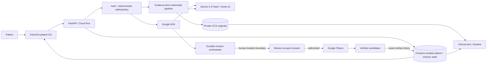

# HealthIA ONE — Devpost Wave 3 OPERATION WIN

## Category

**Taskmaster**

## One-line pitch

**HealthIA ONE turns scattered patient evidence into durable health missions that use Gemini + Google ADK to act, persist, safely pause for human consent, and resume until the next evidence-backed outcome.**

## Why this exists

Healthcare continuity is still a manual job for the patient. Symptoms live in memory, results in portals, measurements in devices, follow-up in calendars, and care options in search results. A chatbot can explain one fragment, but it usually forgets the job as soon as the conversation ends.

HealthIA ONE makes **continuity itself the Taskmaster workflow**.

The patient has one conversational control surface. Behind it, HealthIA can retrieve authorized longitudinal context, ask only the next useful clinical questions, preserve original evidence before interpreting it, update durable patient state, carry a mission across turns, use Google services when needed, and stop at the exact points where human consent or choice is required.

## The agentic loop

```text
patient goal or event
  → patient-scoped auth + deterministic safety boundary
  → retrieve durable longitudinal context
  → Gemini / Google ADK planning and tool execution only when needed
  → persist evidence and mission state
  → call real Google services when authorized
  → stop at genuine human/external boundary
  → resume the same mission from durable state
  → persist the evidence-backed outcome
```

This is intentionally not a permanent swarm. It is demand-driven and event-driven so execution remains auditable, bounded and clinically safer.

## What HealthIA ONE does

### 1. Adaptive clinical conversation

A patient can describe a problem naturally. A real Google ADK runtime inspects authorized baseline context and deterministic safety/interview state. Gemini 3.5 Flash generates case-specific structured questions. Later blocks receive the actual prior prompts and answers, so the conversation adapts instead of restarting or repeating known facts.

### 2. Evidence-first multimodal results

For a synthetic PDF or clinical image:

1. HealthIA persists the original bytes first in private Google Cloud Storage;
2. Gemini 3.5 Flash on Vertex AI extracts only readable evidence under a bounded schema;
3. Firestore stores patient-scoped result/document state;
4. the clinical twin/timeline receives provenance to both the derived result and original evidence;
5. if extraction is unreadable or fails, the original remains stored and the result stays pending instead of fabricating findings.

The system supports common clinical result classes including laboratory reports, CT/TAC, MRI/RM, X-ray, ultrasound, ECG/EKG, pathology and clinical reports.

### 3. Closed-loop durable Taskmaster missions

HealthIA does not mark a task complete because a model produced a paragraph. A result mission becomes complete only when the persisted evidence-backed outcome exists. A later request can retrieve the saved result/original evidence without spending another model call simply to paraphrase data already stored.

### 4. Evidence-backed reference resolution

Wave 3 adds natural continuity across turns. When the patient refers to something previously discussed, HealthIA resolves the reference against durable patient evidence. If a reference is not sufficiently anchored, the system fails closed rather than inventing which item the patient meant.

### 5. Real Google Places with mission-scoped consent

When a durable mission reaches a location-dependent care/resource step, HealthIA **stops before location use**. It asks for mission-scoped location consent. Only after explicit consent does it resume the same mission and execute real Google Places discovery.

This is a core product behavior: autonomy continues until a real human boundary, not past it.

### 6. Exact human choice without unnecessary model interpretation

After verified Places candidates exist, a patient can say **“The second one.”** HealthIA deterministically selects the exact second durable candidate. It does not spend another Gemini round to reinterpret a bounded ordinal choice, does not invent another place, and does not perform an external write.

### 7. Persistence that survives the conversation

The mission, result/evidence state and selected Google candidate survive logout/login. Earlier Cloud proof also demonstrates Firestore/GCS continuity across a genuinely new Cloud Run revision while another patient remains isolated from the first patient's evidence.

## Google stack

- **Gemini 3.5 Flash**
- **Vertex AI** through ADC / Google Cloud service identity
- **Google Agent Development Kit (ADK)**
- **Google GenAI SDK**
- **Cloud Run**
- **Firestore**
- **Google Cloud Storage**
- **Secret Manager**
- **Cloud Build**
- **Google Places / Maps** for authorized resource discovery

The Cloud proof path does not inject a Gemini API key into Cloud Run. Wave 3 verifies the Maps credential is provided through Secret Manager and absent as plaintext.

## Architecture in one view



## Production-minded boundaries

- patient-scoped Firestore state and private evidence paths;
- cross-patient document denial;
- original evidence persisted before AI interpretation;
- fail-closed reference and multimodal behavior;
- mission-scoped location consent;
- exact deterministic candidate selection after discovery;
- secrets referenced through Secret Manager rather than printed into runtime configuration;
- separate build/runtime service identities;
- bounded proof deployment and explicit model request ceiling;
- explicit opt-in billable Cloud/recording workflows;
- synthetic patients and synthetic clinical evidence only in the hackathon proof.

## What we proved — Wave 3 LIVE PASS

**Winning application source:**

`b5254a54fa9ae50edf29fc09964fbd8957625b12`

**Private exact-source one-take:**

- GitHub Actions run `31533575382` — SUCCESS
- job `93919195798` — SUCCESS
- fresh recorder revision `healthia-one-demo-00027-z88`
- exact product image identity verified
- `RequestLimit=20`
- Gemini/ADK timeout `60 s`
- Maps Secret Manager binding verified; plaintext secret absent
- continuous recorder report `285.34 s`
- 15/15 recorder checks PASS
- video SHA-256 `64a40e17d2cd10d3341db20209a8dec6337c1f9591b6348a9e3cd5135fbb99c2`
- artifact `9118046695`
- artifact digest `sha256:d59095439a47e4b724681453079bcde22d170f62cc2720cd07d9922982ac9f7a`

### Wave 3 checks

- English patient OS login
- live Cloud runtime readiness
- unanchored reference fails closed
- live Gemini + ADK question block 1
- live Gemini + ADK question block 2
- clinical orientation completion
- multimodal result persisted with original evidence
- result Taskmaster mission completed
- evidence-backed reference resolution
- Places stops before location consent
- mission-scoped consent then real Places
- explicit ordinal resumes and selects durable candidate
- relogin continuity including Google mission
- exact `.run.app` + readiness visible
- zero browser console/page errors

## Additional preserved proof

Earlier exact-candidate evidence independently proves:

- real Vertex Gemini 3.5 and Google ADK execution;
- Firestore + private GCS;
- two-patient isolation;
- multimodal PDF extraction;
- original-evidence round trip;
- clinical-twin provenance;
- completed Taskmaster result mission;
- logout/login restoration;
- persistence across a new Cloud Run revision;
- continuous public judge demo and byte-identical public Release verification.

The evidence index lives in `docs/EVIDENCE.md` and sanitized machine-readable proof lives under `hackathon/evidence/`.

## Why this is different from a health chatbot

A chatbot can answer **“What does this result mean?”**

HealthIA can carry the larger job:

**remember the patient context → preserve the original → interpret bounded evidence → connect it longitudinally → resolve later references → continue the mission → ask permission exactly when needed → use a real Google provider → apply the patient’s exact choice → persist the outcome.**

That is the product.

## Findings and learnings

1. **Autonomy needs boundaries, not just more tools.** The strongest behavior in Wave 3 is knowing when to stop for consent and how to resume the same durable mission afterward.
2. **Evidence should predate interpretation.** Persisting original bytes first creates a recoverable provenance boundary if a model later fails.
3. **A bounded human choice does not require another LLM round.** Deterministic ordinal selection reduced latency/cost while preserving exact patient intent.
4. **Durability must cross process/session boundaries.** Relogin and cross-revision tests catch false “memory” that exists only in a browser or process.
5. **Fail-closed reference handling matters in longitudinal health.** It is safer to admit an unanchored reference than silently attach new reasoning to the wrong prior event.
6. **Agentic does not mean always-on.** Demand-driven execution is cheaper, easier to audit and better aligned with patient consent.
7. **Demo claims need machine-verifiable evidence.** The one-take recorder outputs semantic checks, exact candidate identity, video hash and a preserved artifact rather than relying on narration.

## Clinical truth boundary

HealthIA ONE is a patient continuity system and hackathon prototype, not a physician, emergency service, autonomous prescription engine, regulated medical device or clinical-effectiveness claim. It can organize patient-provided evidence, surface deterministic safety signals, explain readable content, maintain follow-up missions and help identify care resources. It does not autonomously diagnose or start/stop/change treatment.

## Repository

`https://github.com/arisnachy/healthia-one`

## Reproducible testing

The repository README includes zero-spend local setup plus bounded Cloud proof deployment. Full verification includes pytest, Full System, Chromium E2E, compile/smoke/JUDGE gates, frontend validation, PowerShell parsing and release verification.

## Submission video strategy

The preserved Wave 3 one-take is the strongest current private technical proof. Before final Devpost submission, publish a judge-consumable YouTube/Vimeo version of an exact-source continuous demo targeting approximately four minutes. Do not replace preserved proof until the replacement itself passes an exact-source gate.

## Bonus strategy

Prefer low-risk bonus points that do not alter the proven product:

- public technical build article explicitly created for the All Things Agentic Hackathon;
- public LinkedIn/X post with `#AllThingsAgenticHackathon`;
- only add Gemma/Veo/Lyria if the integration is real, isolated, useful and independently proven without weakening the core.
